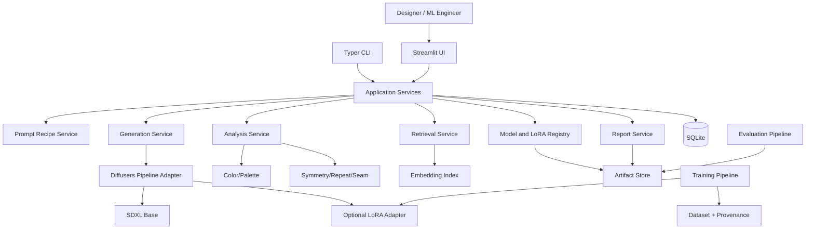

# HALI AI CARPET DESIGN — CURSOR MASTER BUILD SPECIFICATION

> **Belge türü:** Tek kaynaklı, uçtan uca uygulama sözleşmesi  
> **Hedef:** Cursor AI Agent’ın boş bir klasörden başlayarak çalışan, test edilmiş, ölçülmüş ve deploy edilebilir bir yapay zekâ destekli halı tasarım sistemi kurması  
> **Repo adı:** `hali-ai-carpet-design`  
> **Ürün adı:** `Halı AI Carpet Design`  
> **Teknik kapsam:** SDXL tabanlı tasarım üretimi, LoRA fine-tuning, veri/provenance yönetimi, renk ve desen analizi, koleksiyon yakın-benzerlik araması, kontrollü üretilebilirlik tavsiyesi  
> **Hedef donanım:** Windows veya Linux, NVIDIA RTX 4070 Laptop GPU; CPU ile model-yok/degraded UI zorunlu  
> **Ana teknoloji:** Python 3.11, PyTorch, Hugging Face Diffusers, Accelerate, PEFT, SDXL, Streamlit, SQLite  
> **Durum:** Normatif ana belge  
> **Belge önceliği:** Bu dosya eski `carpet-design-gan`, dağınık kod taslakları, README örnekleri ve eski `.cursorrules` dosyasından üstündür.

---

# 0. CURSOR AGENT İÇİN BAŞLANGIÇ EMRİ

Bu depoyu sıfırdan kuran uygulama ajanısın. Bu belgenin tamamını okumadan kod üretme.

Bağlayıcı kurallar:

1. Bu belgeyi tek proje gerçeği olarak kabul et.
2. Projenin amacı halı **tasarımı üretmek ve tasarım özelliklerini analiz etmektir**; kusur/anomali tespiti yapmak değildir.
3. `WEAVEVISION_CURSOR_MASTER_BUILD_SPEC_FINAL.md` ayrı ürüne aittir. WeaveVision kodunu, modelini, veri setini, model registry’sini veya veritabanını bu repoya taşıma.
4. Fazları belirtilen sırayla uygula. Kabul kapısı geçmeden sonraki fazı tamamlanmış sayma.
5. Kullanıcıdan her faz için onay bekleme. Yalnız lisans, hesap, token, GPU sürücüsü veya geri döndürülemez dış işlem gerektiren noktada dur.
6. Bir dış kaynak eksikse sistemi programatik fixture’lar, küçük lisanslı örnekler ve mock model adapter ile kur; engeli `docs/BLOCKERS.md` içine yaz.
7. Başarı metriği, dataset sayısı, eğitim sonucu veya üretim performansı uydurma. Çalıştırılmayan deney `NOT_RUN` olur.
8. Production-path kodunda `TODO`, yalnız `pass`, sahte model çıktısı veya sabit başarı sonucu bırakma.
9. Her milestone sonunda:
   - `ruff` çalıştır,
   - `mypy` çalıştır,
   - `pytest` çalıştır,
   - ilgili smoke/integration testini çalıştır,
   - `docs/EXECUTION_LOG.md` güncelle,
   - `CHANGELOG.md` güncelle.
10. UI ince kalmalıdır. Model, veri, analiz ve persistence mantığı `services/` ve domain katmanlarında bulunur.
11. Gizli anahtarları koda, notebook’a, loga, Docker image’a veya Git geçmişine koyma.
12. Tüm yollar `pathlib.Path` ile yönetilir.
13. Public class/function/method type hints ve Google-style docstring içerir.
14. İstisnaları yalnız sorumluluk sınırlarında yakala; hataları sessizce yutma.
15. Büyük model, dataset, cache ve üretilen görseller Git’e eklenmez.
16. Kullanıcıya “şirket üretim standardına uygun”, “üretime hazır”, “özgünlük garantili” veya “telif açısından güvenli” hükmü verme; bu claim’ler şirket verisi ve hukuk/üretim doğrulaması olmadan yasaktır.
17. Uygulama model veya LoRA yokken açılmalı ve doğru degraded durum göstermelidir.
18. Her çıktı; model kimliği, LoRA kimliği, prompt reçetesi, seed, scheduler, inference parametreleri ve kaynak veri manifestiyle izlenebilir olmalıdır.

## 0.1 İlk yürütme sırası

```text
workspace audit
    ↓
legacy cleanup and scope lock
    ↓
repository bootstrap
    ↓
environment doctor
    ↓
dataset governance and provenance
    ↓
preprocessing and caption contract
    ↓
base SDXL inference
    ↓
LoRA training smoke
    ↓
design analysis modules
    ↓
evaluation and human review
    ↓
Streamlit product
    ↓
Docker/CI/release
    ↓
company-controlled design pilot
```

## 0.2 İlk terminal komutları

```bash
git init
python --version
nvidia-smi
```

Python 3.11 yoksa ortamı rastgele farklı sürümle kurma. GPU görünmüyorsa bootstrap, unit test, UI degraded mode ve mock inference tamamlanır; gerçek SDXL/LoRA koşuları `HARDWARE_BLOCKED` olarak kaydedilir.

---

# 1. COMPANY AI SUITE SINIRI

Bu ürün ve WeaveVision tamamen ayrıdır.

```text
hali-ai-suite/
├── weavevision/              # kusur/anomali tespiti
├── carpet-designer/          # tasarım üretimi
└── shared-libs/              # opsiyonel, model-agnostic yardımcı paketler
```

## 1.1 Carpet Designer’ın sorumluluğu

- metinden halı tasarımı üretmek,
- kontrollü stil ve motif parametreleri uygulamak,
- LoRA ile lisanslı veri üzerinde alan uyarlaması yapmak,
- renk paleti çıkarmak,
- tekrar/seam/simetri gibi dijital tasarım özelliklerini ölçmek,
- koleksiyonda yakın-benzer tasarımları göstermek,
- kullanıcıya kanıt düzeyi açık tavsiye üretmek,
- tasarım sürecini izlenebilir raporlamak.

## 1.2 Carpet Designer’ın yapmayacağı işler

- üretim kusuru tespiti,
- kalite kontrol kararı,
- fiziksel dayanıklılık tahmini,
- tezgâh arızası teşhisi,
- boya reçetesi üretimi,
- hukuki özgünlük/telif garantisi,
- “gerçek şirket ürünü” iddiası,
- şirket onayı olmadan marka ortaklığı iddiası,
- izinsiz şirket kataloğu veya internet görseliyle eğitim.

## 1.3 Paylaşılabilecek yardımcı parçalar

Yalnız modelden bağımsız paketler paylaşılabilir:

- güvenli görüntü okuma/yazma,
- SHA-256 ve canonical manifest,
- structured logging,
- config loader,
- genel rapor şeması,
- path sanitization.

Paylaşılan paketler ayrı semantic version kullanır. İki ürün birbirinin repo içi kaynak kodunu doğrudan import etmez.

---

# 2. NET TEKNİK HÜKÜM

Halı AI Carpet Design:

- SDXL tabanlı temel modelle çalışan,
- opsiyonel LoRA adaptörü yükleyen,
- stil/motif/palet/kompozisyon kontrollü prompt reçetesi oluşturan,
- deterministik seed ile tekrar üretilebilen,
- üretilen görüntüyü renk, simetri, tekrar edilebilirlik ve yakın-benzerlik açısından analiz eden,
- veri ve model kökenini kayıt altına alan,
- Streamlit üzerinden tekil ve toplu tasarım üretimi yapan,
- her sonucu JSON/PNG/HTML raporu olarak dışa aktaran

yerel bir tasarım destek sistemidir.

Ana ürün adı “GAN” içermez. Çünkü varsayılan model ailesi diffusion’dır.

Repo:

```text
hali-ai-carpet-design
```

Başlık:

```text
Halı AI Carpet Design — Traceable Diffusion-Based Carpet Design Studio
```

---

# 3. CLAIM VE KANIT SÖZLEŞMESİ

## 3.1 İzinli claim’ler

| Claim | Zorunlu kanıt |
|---|---|
| “Sistem SDXL ile görsel üretir.” | Gerçek inference smoke artifact’i |
| “LoRA yüklenebilir.” | LoRA load/unload integration testi |
| “Aynı seed tekrar üretilebilir.” | Determinism tolerance testi |
| “Renk paleti çıkarır.” | Programatik renk fixture testleri |
| “Seam/tileability skoru hesaplar.” | Sentetik kusursuz/kusurlu tile fixture testi |
| “Yakın benzerleri bulur.” | Kalibre edilmiş retrieval validation seti |
| “RTX 4070 üzerinde çalışır.” | GPU adı, VRAM, p50/p95 üretim süresi |
| “CPU fallback vardır.” | Uygulama açılışı ve analiz modülleri; gerçek SDXL üretimi opsiyonel/blocking olabilir |
| “Model X daha iyi.” | Aynı prompt seti, seed seti, değerlendirme protokolü ve insan değerlendirmesi |
| “LoRA kaliteyi artırdı.” | Base-vs-LoRA blinded comparison ve metrikler |

## 3.2 Yasak claim’ler

- “şirket üretim standardına uygundur.”
- “%100 özgün tasarım.”
- “Telif ihlali yoktur.”
- “Gerçek halıdan ayırt edilemez.”
- “FID düşük olduğu için üretime hazırdır.”
- “8 renk altı her tasarım dokunabilir.”
- “CLIP benzerliği düşükse tasarım yenidir.”
- “AI tasarımcıdan daha iyidir.”
- “Koleksiyon süresini %X azaltır.” — ölçülmüş iş süreci deneyi olmadan.
- “hak sahibi şirket tarafından onaylıdır.” — resmî izin olmadan.

## 3.3 Durum sözlüğü

```text
NOT_RUN
PASS
FAIL
BLOCKED
HARDWARE_BLOCKED
LICENSE_BLOCKED
PASS_WITH_RESTRICTIONS
DEMO_ONLY
```

---

# 4. KULLANICILAR VE KULLANIM SENARYOLARI

## 4.1 Kullanıcılar

### Tasarımcı

- prompt ve stil parametreleri belirler,
- alternatif tasarımlar üretir,
- varyantları karşılaştırır,
- palet ve motif analizini inceler,
- tasarımı indirir veya koleksiyona aday olarak kaydeder.

### ML mühendisi

- dataset manifesti oluşturur,
- caption kalitesini denetler,
- LoRA eğitir,
- model/adapter karşılaştırır,
- değerlendirme ve benchmark çalıştırır.

### Tasarım yöneticisi

- deney geçmişini inceler,
- yakın-benzer tasarımları görür,
- insan değerlendirme sonuçlarını karşılaştırır,
- pilot için aday tasarımları dışa aktarır.

## 4.2 Kullanıcı hikâyeleri

```text
US-01: Kullanıcı stil, motif, palet ve kompozisyon seçerek prompt reçetesi oluşturur.
US-02: Kullanıcı seed belirleyerek aynı reçeteyi tekrar üretebilir.
US-03: LoRA yoksa kullanıcı açıkça BASE_MODEL_DEMO durumunu görür.
US-04: Kullanıcı birden fazla varyantı batch olarak üretebilir.
US-05: Her varyantın prompt, negative prompt, seed ve scheduler bilgisi kaydedilir.
US-06: Sistem dominant renk ve CIELAB palet özetini çıkarır.
US-07: Sistem simetri, seam ve repeatability analizini gösterir.
US-08: Sistem koleksiyondaki en yakın tasarımları listeler.
US-09: Kullanıcı seçili tasarımı PNG ve JSON reçetesiyle indirir.
US-10: Kullanıcı tasarımı aday koleksiyona eklemek için insan onayı verir.
US-11: ML mühendisi LoRA training run başlatır ve artifact’leri kaydeder.
US-12: Benchmark sayfası yalnız gerçek artifact’lerden metrik gösterir.
US-13: Model yokken UI açılır ve kurulum durumunu gösterir.
US-14: Lisansı belirsiz veri training pipeline’a alınmaz.
US-15: İnsan değerlendirici base ve LoRA çıktısını kör biçimde puanlar.
```

---

# 5. MVP VE KAPSAM DIŞI

## 5.1 MVP

- lisans/provenance kayıtlı veri adaptörü,
- veri denetimi ve preprocessing,
- SDXL base inference,
- opsiyonel LoRA load/unload,
- LoRA smoke training,
- prompt recipe builder,
- palette extraction,
- CIELAB/Delta E tabanlı palet karşılaştırma,
- simetri analizi,
- seam/tileability analizi,
- CLIP/DINO veya seçili embedding ile retrieval,
- exact/pHash duplicate kontrolü,
- Streamlit single/batch generation,
- SQLite history,
- JSON/PNG/HTML export,
- unit/integration/contract/smoke testleri,
- GPU latency/VRAM benchmark,
- Docker CPU-degraded ve CUDA profilleri,
- CI ve release check.

## 5.2 Araştırma kapsamı

MVP’den sonra:

- ControlNet ile geometri kontrolü,
- IP-Adapter ile referans kompozisyon,
- inpainting ile motif düzenleme,
- motif segmentation,
- vectorization/SVG araştırması,
- seamless texture optimization,
- multi-LoRA adapter composition,
- preference optimization,
- tasarımcı geri bildirimiyle ranking modeli,
- şirket iplik kataloğuna bağlı palet eşleştirme,
- üretim simülatörü entegrasyonu.

## 5.3 Kapsam dışı

- otomatik üretim hattı kontrolü,
- fiziksel numune performansı,
- patent/telif uygunluk kararı,
- ERP/MES entegrasyonu,
- cloud multi-tenant SaaS,
- kullanıcı ödeme sistemi,
- gerçek zamanlı ortak düzenleme,
- anomali/kusur tespiti,
- marka kataloglarının izinsiz kopyalanması.

---

# 6. SİSTEM MİMARİSİ

## 6.1 Mimari hüküm

İlk sürüm modüler monolit olacaktır.



## 6.2 Ana sınırlar

- UI doğrudan Diffusers pipeline oluşturmaz.
- Pipeline adapter framework ayrıntılarını service katmanından gizler.
- Training ve inference ayrı process/command olarak çalışabilir.
- Registry model metadata yönetir; ağır dosyalar artifact store’dadır.
- Retrieval index, generated design DB’den ayrıdır.
- Dataset provenance training’in zorunlu ön koşuludur.

## 6.3 Üretim akışı

```text
user controls
    ↓
prompt recipe validation
    ↓
model + LoRA resolve
    ↓
resource preflight
    ↓
generation
    ↓
image safety/validity checks
    ↓
color + geometry + retrieval analysis
    ↓
persist recipe and artifacts
    ↓
render UI and export report
```

---

# 7. NİHAİ REPOSITORY YAPISI

```text
hali-ai-carpet-design/
├── .cursor/
│   └── rules/
│       └── carpet-designer.mdc
├── .github/
│   └── workflows/
│       ├── ci.yml
│       └── security.yml
├── .streamlit/
│   └── config.toml
├── configs/
│   ├── app.yaml
│   ├── palettes.yaml
│   ├── prompt_taxonomy.yaml
│   ├── models/
│   │   ├── sdxl_base.yaml
│   │   └── sdxl_lora.yaml
│   ├── training/
│   │   ├── smoke_lora.yaml
│   │   └── full_lora.yaml
│   └── evaluation/
│       ├── benchmark.yaml
│       └── human_review.yaml
├── data/
│   ├── external/
│   │   └── .gitkeep
│   ├── interim/
│   │   └── .gitkeep
│   ├── processed/
│   │   └── .gitkeep
│   ├── fixtures/
│   │   ├── images/
│   │   └── captions/
│   └── manifests/
│       └── .gitkeep
├── artifacts/
│   ├── datasets/
│   ├── training/
│   ├── models/
│   ├── generations/
│   ├── evaluations/
│   ├── reports/
│   ├── indexes/
│   └── logs/
├── docs/
│   ├── ARCHITECTURE.md
│   ├── CLAIM_CONTRACT.md
│   ├── DATASET_AND_LICENSE_REGISTER.md
│   ├── DATA_CARD.md
│   ├── MODEL_CARD.md
│   ├── TRAINING_PROTOCOL.md
│   ├── EVALUATION_PROTOCOL.md
│   ├── USER_GUIDE.md
│   ├── COMPANY_DESIGN_PILOT_RUNBOOK.md
│   ├── BLOCKERS.md
│   ├── EXECUTION_LOG.md
│   └── FINAL_VERDICT.md
├── notebooks/
│   ├── 01_dataset_audit_and_eda.ipynb
│   ├── 02_caption_quality_review.ipynb
│   ├── 03_lora_training_analysis.ipynb
│   └── 04_generation_failure_analysis.ipynb
├── scripts/
│   ├── bootstrap.ps1
│   ├── bootstrap.sh
│   ├── import_met_open_access.py
│   ├── import_vna.py
│   ├── verify_dataset.py
│   ├── build_retrieval_index.py
│   ├── update_readme_metrics.py
│   └── release_check.py
├── src/
│   └── carpet_designer/
│       ├── __init__.py
│       ├── __main__.py
│       ├── cli.py
│       ├── settings.py
│       ├── logging_config.py
│       ├── domain/
│       │   ├── __init__.py
│       │   ├── enums.py
│       │   ├── schemas.py
│       │   ├── errors.py
│       │   └── protocols.py
│       ├── data/
│       │   ├── __init__.py
│       │   ├── manifest.py
│       │   ├── provenance.py
│       │   ├── audit.py
│       │   ├── split.py
│       │   ├── captions.py
│       │   ├── preprocessing.py
│       │   └── adapters/
│       │       ├── __init__.py
│       │       ├── base.py
│       │       ├── met_open_access.py
│       │       ├── vna.py
│       │       ├── local_folder.py
│       │       └── company.py
│       ├── prompts/
│       │   ├── __init__.py
│       │   ├── taxonomy.py
│       │   ├── recipe.py
│       │   ├── templates.py
│       │   ├── validation.py
│       │   └── negative.py
│       ├── models/
│       │   ├── __init__.py
│       │   ├── pipeline_adapter.py
│       │   ├── device.py
│       │   ├── scheduler.py
│       │   ├── lora.py
│       │   ├── registry.py
│       │   └── memory.py
│       ├── training/
│       │   ├── __init__.py
│       │   ├── dataset.py
│       │   ├── trainer.py
│       │   ├── checkpoints.py
│       │   ├── validation.py
│       │   └── telemetry.py
│       ├── analysis/
│       │   ├── __init__.py
│       │   ├── colors.py
│       │   ├── delta_e.py
│       │   ├── symmetry.py
│       │   ├── seam.py
│       │   ├── repeatability.py
│       │   ├── frequency.py
│       │   ├── motif_density.py
│       │   └── composite.py
│       ├── retrieval/
│       │   ├── __init__.py
│       │   ├── embeddings.py
│       │   ├── index.py
│       │   ├── duplicate.py
│       │   ├── calibration.py
│       │   └── search.py
│       ├── evaluation/
│       │   ├── __init__.py
│       │   ├── generative_metrics.py
│       │   ├── prompt_adherence.py
│       │   ├── diversity.py
│       │   ├── human_review.py
│       │   ├── benchmark.py
│       │   └── plots.py
│       ├── services/
│       │   ├── __init__.py
│       │   ├── generation_service.py
│       │   ├── training_service.py
│       │   ├── analysis_service.py
│       │   ├── retrieval_service.py
│       │   ├── collection_service.py
│       │   ├── evaluation_service.py
│       │   ├── report_service.py
│       │   └── health_service.py
│       ├── persistence/
│       │   ├── __init__.py
│       │   ├── database.py
│       │   ├── migrations.py
│       │   └── repositories.py
│       ├── reporting/
│       │   ├── __init__.py
│       │   ├── json_report.py
│       │   ├── html_report.py
│       │   ├── export_bundle.py
│       │   └── templates/
│       │       ├── generation_report.html.j2
│       │       └── evaluation_report.html.j2
│       └── ui/
│           ├── __init__.py
│           ├── app.py
│           ├── state.py
│           ├── components.py
│           └── pages/
│               ├── 1_Design_Studio.py
│               ├── 2_Variant_Batch.py
│               ├── 3_Collection_Search.py
│               ├── 4_LoRA_Registry.py
│               ├── 5_Evaluation.py
│               └── 6_System_Health.py
├── tests/
│   ├── conftest.py
│   ├── unit/
│   ├── integration/
│   ├── contract/
│   └── smoke/
├── .dockerignore
├── .env.example
├── .gitignore
├── .pre-commit-config.yaml
├── CHANGELOG.md
├── Dockerfile.cpu
├── Dockerfile.cuda
├── LICENSE
├── Makefile
├── README.md
├── compose.yaml
├── compose.gpu.yaml
├── pyproject.toml
├── uv.lock
└── HALI_AI_CARPET_DESIGN_MASTER_BUILD_SPEC.md
```

---

# 8. CURSOR KURAL DOSYASI

`.cursor/rules/carpet-designer.mdc`:

```markdown
---
description: Halı AI Carpet Design implementation rules
alwaysApply: true
---

# Carpet Designer Agent Rules

- Read `HALI_AI_CARPET_DESIGN_MASTER_BUILD_SPEC.md` before architectural changes.
- Do not import or embed WeaveVision anomaly-detection code.
- Do not invent datasets, licenses, model results, FID values or business impact.
- Do not claim manufacturability, originality or copyright safety without external evidence.
- Keep UI thin; use services and typed domain schemas.
- Use pathlib for all external paths.
- Public APIs require type hints and Google-style docstrings.
- Catch exceptions only at responsibility boundaries; never silently swallow errors.
- Preserve dataset provenance and source license in every training manifest.
- Never commit datasets, model weights, secrets, caches or generated collections.
- Production paths must not contain TODO/pass-only/fake outputs.
- Every feature requires tests.
- Run ruff, mypy and pytest before closing a milestone.
- Record real commands and outputs in `docs/EXECUTION_LOG.md`.
- Mark unexecuted experiments `NOT_RUN`.
- Continue autonomously unless blocked by license, account/token, hardware or irreversible external action.
```

---

# 9. ORTAM VE BAĞIMLILIK SÖZLEŞMESİ

## 9.1 Python ve paket yönetimi

- Python: `>=3.11,<3.12`
- Paket yöneticisi: `uv`
- Dependency source of truth: `pyproject.toml` + `uv.lock`
- PyTorch CUDA paketi platforma göre resmî kurulum kanalından seçilir.
- Eski sabit sürümler “test edilmiş” diye kopyalanmaz.
- Uyumlu kombinasyon gerçek smoke test sonrası lock edilir.

Başlangıç paket aileleri:

```toml
[project]
name = "hali-ai-carpet-design"
version = "0.1.0"
requires-python = ">=3.11,<3.12"
dependencies = [
  "diffusers>=0.39,<0.40",
  "transformers>=4.57,<5",
  "accelerate>=1,<2",
  "peft>=0.19,<0.20",
  "safetensors>=0.5,<1",
  "huggingface-hub>=0.34,<1",
  "streamlit>=1.59,<2",
  "pydantic>=2.11,<3",
  "pydantic-settings>=2.10,<3",
  "PyYAML>=6,<7",
  "numpy>=2,<3",
  "pandas>=2.2,<4",
  "Pillow>=11,<13",
  "opencv-python-headless>=4.10,<5",
  "scikit-image>=0.24,<1",
  "scikit-learn>=1.6,<2",
  "plotly>=6,<7",
  "jinja2>=3.1,<4",
  "typer>=0.16,<1",
  "rich>=14,<15",
  "orjson>=3.10,<4",
  "filelock>=3.18,<4",
  "psutil>=7,<8"
]

[project.optional-dependencies]
training = [
  "datasets>=4,<5",
  "tensorboard>=2.19,<3"
]
retrieval = [
  "faiss-cpu>=1.11,<2"
]
evaluation = [
  "clean-fid>=0.1.35,<1"
]
dev = [
  "pytest>=8.4,<9",
  "pytest-cov>=6.2,<7",
  "pytest-xdist>=3.8,<4",
  "ruff>=0.12,<1",
  "mypy>=1.16,<2",
  "pre-commit>=4.2,<5",
  "types-PyYAML>=6"
]

[project.scripts]
carpet-designer = "carpet_designer.cli:app"
```

Bu sürüm aralıkları başlangıç hipotezidir. `uv lock` ve gerçek import/training smoke testi geçmeden uyumlu oldukları iddia edilmez.

## 9.2 `.env.example`

```dotenv
HUGGINGFACE_TOKEN=
HF_HOME=artifacts/cache/huggingface
CARPET_DESIGNER_DEVICE=auto
CARPET_DESIGNER_LOG_LEVEL=INFO
CARPET_DESIGNER_TELEMETRY=false
```

Token yalnız gated model veya authenticated download gerekiyorsa kullanılır.

## 9.3 Bootstrap

Windows:

```powershell
powershell -ExecutionPolicy Bypass -File scripts/bootstrap.ps1
```

Linux:

```bash
bash scripts/bootstrap.sh
```

Beklenen:

```bash
uv venv --python 3.11
uv sync --all-extras
uv run pre-commit install
uv run carpet-designer doctor
```

## 9.4 Environment doctor

`carpet-designer doctor`:

- Python/OS,
- GPU/driver/CUDA,
- PyTorch,
- Diffusers,
- Transformers,
- PEFT,
- aktif device ve dtype,
- xFormers/SDPA durumu,
- disk/RAM/VRAM,
- Hugging Face cache,
- model/LoRA registry,
- DB,
- writable paths,
- fixture analiz smoke,
- model yok UI readiness

kontrollerini yapar ve `artifacts/reports/system_doctor.json` üretir.

---

# 10. GİT VE ARTIFACT POLİTİKASI

`.gitignore` en az:

```gitignore
.venv/
__pycache__/
.pytest_cache/
.mypy_cache/
.ruff_cache/
.coverage
htmlcov/
.env
.streamlit/secrets.toml

artifacts/cache/**
artifacts/models/**
artifacts/training/**
artifacts/generations/**
artifacts/indexes/**
artifacts/logs/**
!artifacts/**/.gitkeep

data/external/**
data/interim/**
data/processed/**
!data/**/.gitkeep
!data/fixtures/**

*.safetensors
*.ckpt
*.pt
*.pth
*.bin
*.onnx
*.engine
*.zip
*.tar
*.png
*.jpg
*.jpeg
!assets/**
```

Manifest, model card, config ve küçük lisanslı fixture’lar Git’e girebilir. Ağır binary’ler giremez.

---

# 11. VERİ YÖNETİŞİMİ VE LİSANS

## 11.1 Temel kural

Eğitim verisi yalnız şu koşullarda kullanılabilir:

- açık ve kayıtlı lisans,
- eğitim/yeniden kullanım izni,
- kaynak URL veya kurumsal permission ref,
- dosya hash’i,
- veri edinme tarihi,
- eserin kimliği ve metadata’sı,
- türetilmiş dosyalar için provenance zinciri.

## 11.2 Önerilen kaynak sınıfları

- Museum Open Access/CC0 koleksiyonları,
- kullanım izni açık kurum API’leri,
- lisansı doğrulanmış araştırma datasetleri,
- kullanıcının/şirketin açık izin verdiği koleksiyon,
- sentetik veya programatik fixture’lar.

Kaggle kaydı tek başına lisans kanıtı değildir. Mirror dataset, orijinal lisans ve kaynak doğrulanmadan kullanılmaz.

## 11.3 Yasak veri toplama

- Google Images scraping,
- sosyal medya scraping,
- marka e-ticaret kataloğunu izinsiz indirme,
- watermark kaldırma,
- kaynağı bilinmeyen ZIP dataset,
- lisans alanlarını boş bırakma,
- test/evaluation görsellerini training’e taşıma,
- şirket görsellerini açık artifact veya telemetry’ye gönderme.

## 11.4 Veri lisans kayıt tablosu

`docs/DATASET_AND_LICENSE_REGISTER.md`:

| Alan | Açıklama |
|---|---|
| dataset_id | değişmez kimlik |
| source_name | kurum/dataset |
| source_url | resmî kaynak |
| retrieved_at | tarih |
| license | lisans metni/kimliği |
| training_use | yes/no/unclear |
| commercial_use | yes/no/unclear |
| attribution_required | yes/no |
| permission_ref | şirket/özel izin |
| archive_sha256 | arşiv hash’i |
| manifest_sha256 | içerik manifest hash’i |
| image_count | gerçek sayım |
| caption_count | gerçek sayım |
| excluded_count | gerçek sayım |
| restrictions | kısıtlar |
| status | VERIFIED/BLOCKED |

## 11.5 Dataset manifest

```json
{
  "schema_version": "1.0.0",
  "dataset_id": "museum_carpet_v1",
  "source": {
    "name": "official-source",
    "license": "recorded-license",
    "retrieved_at": "ISO-8601"
  },
  "counts": {
    "total": 0,
    "train": 0,
    "validation": 0,
    "test_reference": 0,
    "excluded": 0
  },
  "files": [
    {
      "relative_path": "images/example.jpg",
      "sha256": "...",
      "source_object_id": "...",
      "source_url": "...",
      "license": "...",
      "width": 0,
      "height": 0,
      "caption_path": "captions/example.txt",
      "style_labels": [],
      "palette_labels": [],
      "split": "train"
    }
  ],
  "manifest_sha256": "..."
}
```

## 11.6 Split

- Aynı fiziksel eser, crop, thumbnail veya restore edilmiş varyant farklı split’lere geçemez.
- `source_object_id` group key olarak kullanılır.
- Near-duplicate pHash denetimi yapılır.
- Evaluation prompt seti training caption’larından kopyalanmaz.
- İnsan değerlendirme seti milestone başlamadan kilitlenir.

---

# 12. VERİ ÖN İŞLEME

## 12.1 Görüntü doğrulama

- dosya açılabilirlik,
- EXIF orientation,
- renk modu,
- bit depth,
- minimum çözünürlük,
- watermark/çerçeve metadata flag,
- duplicate hash,
- aşırı sıkıştırma,
- tek renk/boş görüntü.

Dosya otomatik silinmez. Hariç tutma nedeni manifestte tutulur.

## 12.2 Crop stratejisi

Her görüntüyü kör biçimde merkezden kare kesmek yasaktır.

İzinli stratejiler:

- aspect-ratio koruyarak pad,
- subject-aware crop,
- metadata kontrollü square crop,
- farklı aspect bucket’ları,
- yüksek çözünürlük patch’i yalnız kaynak kimliği korunarak.

Crop yöntemi training config’te kaydedilir.

## 12.3 Çözünürlük

- SDXL varsayılan training/inference hedefi `1024x1024` olabilir.
- Donanım kısıtı varsa bucket/gradient checkpointing kullanılır.
- 512/768 çıktılar “SDXL native kalite eşdeğeri” diye sunulmaz.
- Üretilen nihai tasarımın upscale işlemi ayrı artifact olarak kaydedilir.

## 12.4 Caption üretimi

Caption kaynakları:

1. kurum metadata’sı,
2. uzman tarafından düzeltilmiş açıklama,
3. kontrollü şablon,
4. otomatik caption önerisi + insan onayı.

Dosya adından kör stil etiketi türetmek ana yöntem olamaz.

Caption schema:

```json
{
  "subject": "carpet/rug pattern",
  "culture_or_style": [],
  "motifs": [],
  "composition": [],
  "palette": [],
  "geometry": [],
  "texture": [],
  "period": null,
  "source_terms": [],
  "confidence": "human_verified|metadata|auto_suggested",
  "free_text": "..."
}
```

## 12.5 Data card

`docs/DATA_CARD.md`:

- kaynaklar,
- lisanslar,
- kapsam,
- temsil boşlukları,
- kültürel etiketleme sınırlamaları,
- caption kalite oranları,
- duplicate denetimi,
- hariç tutma nedenleri,
- kabul edilen kullanım,
- yasak kullanım.

---

# 13. PROMPT TAXONOMY VE RECIPE

## 13.1 Kontrollü alanlar

```text
style_family
motif_family
central_composition
border_structure
repeat_structure
symmetry
palette
color_constraints
texture
material_visualization
ornament_density
ageing_effect
negative_constraints
```

## 13.2 Başlangıç stil aileleri

- Anadolu geometric,
- Kilim-inspired,
- Ottoman floral,
- Persian medallion,
- contemporary geometric,
- contemporary organic,
- minimalist,
- transitional.

Bu etiketler kültürel gerçeklik garantisi değildir. Veri card’da tanım ve sınırlama bulunur.

## 13.3 Prompt recipe schema

```json
{
  "schema_version": "1.0.0",
  "recipe_id": "recipe_...",
  "style_family": "anatolian_geometric",
  "motifs": ["ram_horn", "diamond"],
  "composition": "central_medallion",
  "border": "multi_band",
  "symmetry": "bilateral",
  "palette_id": "earth_v1",
  "free_text": "...",
  "negative_constraints": ["text", "watermark", "cropped border"],
  "render_intent": "flat_design",
  "seed": 42,
  "width": 1024,
  "height": 1024,
  "steps": 30,
  "guidance_scale": 7.0,
  "scheduler": "configured",
  "model_id": "model_...",
  "lora_ids": [],
  "lora_scales": []
}
```

## 13.4 Prompt validation

- boş recipe reddedilir,
- unsupported style açık hata verir,
- width/height güvenli sınırda olmalıdır,
- seed signed integer aralığı doğrulanır,
- LoRA scale config sınırında olmalıdır,
- çelişkili kontroller kullanıcıya gösterilir,
- prompt injection burada güvenlik açığı olarak görülmese de file/path/token komutları prompttan yürütülmez.

## 13.5 Negative prompt

Başlangıç negatifleri config içindedir; evrensel doğru olarak sunulmaz.

```text
text, watermark, logo, signature, frame, cut-off border,
photographic room scene, folded rug, perspective distortion,
low detail, severe blur, malformed repeated motif
```

Flat design ve room mockup iki ayrı render intent’tir; aynı evaluation setinde karıştırılmaz.

---

# 14. BASE MODEL VE INFERENCE

## 14.1 Base model

Varsayılan:

```text
stabilityai/stable-diffusion-xl-base-1.0
```

Model license ve kullanım şartları model card’dan kaydedilir. Model indirilemezse uygulama degraded açılır.

## 14.2 Pipeline adapter

`pipeline_adapter.py` şunları kapsar:

- lazy load,
- device/dtype seçimi,
- scheduler resolve,
- LoRA adapter load/unload,
- generator yönetimi,
- memory optimization,
- progress callback,
- cancellation-safe cleanup,
- output metadata,
- deterministic settings,
- model hash/model card reference.

## 14.3 Device politikası

```text
CUDA + fp16/bf16 if validated
MPS experimental
CPU degraded or explicit slow-mode
```

Generator:

- CUDA’da CUDA generator,
- CPU’da CPU generator,
- MPS uyumu doğrulanmadıysa CPU generator + MPS pipeline kombinasyonu yalnız smoke test sonrası,
- device mismatch sessizce ignore edilmez.

## 14.4 Bellek optimizasyonu

Config kontrollü:

- attention slicing,
- VAE slicing,
- VAE tiling,
- model CPU offload,
- sequential CPU offload,
- PyTorch SDPA,
- xFormers yalnız kurulu ve test edilmişse,
- `torch.cuda.empty_cache()` yalnız lifecycle boundary’de; performans için her küçük adımda kör çağrı yapılmaz.

OOM akışı:

```text
capture OOM
    ↓
release transient objects
    ↓
record requested shape/settings
    ↓
offer lower batch/resolution/offload profile
    ↓
never return fake image
```

## 14.5 Determinism

Aynı ortam/model/scheduler/seed için mümkün olan tekrar üretilebilirlik hedeflenir. GPU kernel nondeterminism varsa raporlanır. Pixel-perfect garanti verilmez.

## 14.6 Generation result schema

```json
{
  "generation_id": "gen_...",
  "created_at": "ISO-8601",
  "recipe_id": "recipe_...",
  "model_id": "model_...",
  "lora_adapters": [],
  "seed": 42,
  "scheduler": "...",
  "steps": 30,
  "guidance_scale": 7.0,
  "width": 1024,
  "height": 1024,
  "device": "cuda",
  "dtype": "float16",
  "timing_ms": {
    "load": 0.0,
    "generation": 0.0,
    "analysis": 0.0,
    "total": 0.0
  },
  "image_sha256": "...",
  "status": "PASS",
  "warnings": []
}
```

---

# 15. LoRA EĞİTİM SÖZLEŞMESİ

## 15.1 Amaç

LoRA, lisanslı ve provenance kayıtlı halı tasarım verisiyle SDXL’i alan diline uyarlamak için kullanılır. “Carpet LoRA” adı yalnız şirket izni ve şirket verisi varsa kullanılabilir. Varsayılan adapter adı nötrdür.

## 15.2 Eğitim girdileri

- verified dataset manifest,
- caption files,
- split manifest,
- base model ID/revision,
- training config,
- seed,
- environment snapshot,
- license register hash.

## 15.3 Varsayılan eğitim parametreleri

Config örneği:

```yaml
training:
  resolution: 1024
  train_batch_size: 1
  gradient_accumulation_steps: 4
  learning_rate: 0.0001
  max_train_steps: 1000
  rank: 16
  alpha: 16
  mixed_precision: fp16
  gradient_checkpointing: true
  use_8bit_adam: false
  checkpointing_steps: 100
  validation_steps: 100
  seed: 42

lora:
  target: unet
  train_text_encoder: false
  adapter_name: carpet_domain_v1
```

Bunlar performans sonucu değildir. Gerçek donanım/data smoke sonrası ayarlanır.

## 15.4 Training implementation

`trainer.py`:

- Accelerate kullanır,
- PEFT veya Diffusers LoRA API’sini kurulu sürümle uyumlu biçimde kullanır,
- UNet target module seçimini açıkça doğrular,
- optimizer/scheduler config’i snapshot eder,
- gradient clipping,
- mixed precision,
- checkpoint resume,
- validation prompt seti,
- NaN/Inf detection,
- OOM-safe fail,
- artifact hash,
- TensorBoard veya JSONL telemetry

sağlar.

## 15.5 Checkpoint yapısı

```text
artifacts/training/<run_id>/
├── config.resolved.yaml
├── environment.json
├── dataset_manifest.json
├── split_manifest.json
├── license_register.sha256
├── checkpoints/
├── validation_samples/
├── training_metrics.jsonl
├── loss_plot.png
├── final_adapter/
│   ├── adapter_model.safetensors
│   └── adapter_config.json
├── model_card.md
└── run_manifest.json
```

## 15.6 Checkpoint güvenliği

- pickle tabanlı güvensiz artifact tercih edilmez,
- safetensors kullanılır,
- hash doğrulanır,
- dış LoRA adapter’ı allowlist/manifest olmadan yüklenmez,
- adapter ve base model uyumu doğrulanır.

## 15.7 Validation prompt seti

- training caption’larından doğrudan kopya olmaz,
- stil/motif/palet kombinasyonlarını dengeli kapsar,
- milestone öncesi kilitlenir,
- aynı seed seti base-vs-LoRA karşılaştırmasında kullanılır.

## 15.8 LoRA registry durumları

```text
DRAFT
TRAINING
CANDIDATE
VALIDATED
ACTIVE_DEMO
ACTIVE_COMPANY_PILOT
REJECTED
RETIRED
```

---

# 16. RENK VE PALET ANALİZİ

## 16.1 Temel hüküm

RGB Öklid mesafesi tek başına palet uyumu için kullanılmaz. Analiz CIELAB ve Delta E tabanlıdır.

## 16.2 `configs/palettes.yaml`

Başlangıç palette’leri örnek ve değiştirilebilirdir:

```yaml
palettes:
  classic_red_navy_v1:
    status: design_reference_only
    source: project_default
    colors:
      - "#7A1F2B"
      - "#162A5A"
      - "#E8DCC3"
      - "#B58A3A"
  earth_v1:
    status: design_reference_only
    source: project_default
    colors:
      - "#6B3E26"
      - "#A05A2C"
      - "#D6A66A"
      - "#7A6A45"
```

“şirket üretim standardı” yalnız şirket kaynak referansı varsa yazılabilir.

## 16.3 Dominant color extraction

- görüntü kontrollü downsample,
- CIELAB dönüşümü,
- KMeans/MiniBatchKMeans,
- deterministic seed,
- cluster proportion,
- küçük cluster filtreleme,
- hex/LAB/RGB çıktı.

## 16.4 Palette matching

- Delta E 2000 veya doğrulanmış alternatif,
- cluster weight ile ağırlıklı eşleşme,
- palette coverage,
- out-of-palette ratio,
- sonuç “design palette proximity” olarak adlandırılır.

“Boya uygunluğu” denmez.

## 16.5 Color result

```json
{
  "dominant_colors": [],
  "palette_id": "earth_v1",
  "mean_delta_e": 0.0,
  "coverage_ratio": 0.0,
  "out_of_palette_ratio": 0.0,
  "status": "DESIGN_REFERENCE_ONLY"
}
```

---

# 17. GEOMETRİ VE DESEN ANALİZİ

## 17.1 Simetri

Ölçümler:

- horizontal reflection similarity,
- vertical reflection similarity,
- 180-degree rotational similarity,
- central alignment score.

SSIM veya feature-space similarity kullanılabilir. Sonuç “symmetry evidence”dir; kültürel doğruluk değildir.

## 17.2 Seam/tileability

Bir tasarımın tekrar edildiğinde kenar sürekliliği:

- sol-sağ seam difference,
- üst-alt seam difference,
- gradient continuity,
- frequency discontinuity,
- tiled preview.

Fixture:

- kusursuz programatik tile,
- renk seam’i olan tile,
- geometri seam’i olan tile.

## 17.3 Repeatability

- autocorrelation peaks,
- Fourier spectrum periodicity,
- motif spacing consistency,
- repeat cell hypothesis.

Bu analiz gerçek dokuma raporu değildir.

## 17.4 Motif density

- edge density,
- connected region approximation,
- local entropy,
- frequency-band energy.

“Çok karmaşık, dokunamaz” hükmü verilmez. Yalnız tasarım yoğunluğu raporlanır.

## 17.5 Composite advisory

```text
DESIGN_ANALYSIS_ONLY
REVIEW_RECOMMENDED
NO_PRODUCTION_CLAIM
```

Şirket üretim parametreleri sağlanırsa ayrı, versioned rule profile oluşturulur.

---

# 18. KOLEKSİYON BENZERLİĞİ VE RETRIEVAL

## 18.1 Amaç

Yeni tasarıma görsel/semantik olarak yakın kayıtları bulmak. Hukuki özgünlük kararı vermek değildir.

## 18.2 Çoklu sinyal

- exact SHA-256,
- perceptual hash,
- SSIM yalnız hizalanabilir görüntülerde,
- CLIP veya DINO embedding cosine similarity,
- palette distance,
- optional local feature matching.

## 18.3 Duplicate sınıfları

```text
EXACT_DUPLICATE
NEAR_DUPLICATE
SEMANTICALLY_SIMILAR
PALETTE_SIMILAR
NO_CLOSE_MATCH_FOUND
```

`NO_CLOSE_MATCH_FOUND`, koleksiyon dışında özgünlük garantisi değildir.

## 18.4 Threshold calibration

Sabit `0.95` eşiği kullanılmaz.

Validation seti:

- exact duplicates,
- crop/resize/compression near-duplicates,
- aynı motif farklı palet,
- aynı palet farklı motif,
- açıkça farklı tasarımlar.

Eşikler ROC/PR ve insan review ile kilitlenir.

## 18.5 Index

- index version,
- embedding model ID/revision,
- preprocessing hash,
- source collection manifest,
- vector dimension,
- built_at,
- artifact SHA-256.

Collection değişince index invalid olur.

---

# 19. ÜRETİLEBİLİRLİK TAVSİYESİ SINIRI

## 19.1 Varsayılan durum

Şirket tezgâhı, iplik kataloğu, renk limiti, minimum çizgi kalınlığı ve tekrar ölçüleri olmadan sistem yalnız dijital tasarım analizi verir.

## 19.2 Şirket profili gelirse

Config:

```yaml
manufacturing_profile:
  status: company_provided
  profile_id: required
  source_document_ref: required
  max_distinct_yarn_colors: required
  min_feature_width_px_at_target_scale: required
  repeat_width_mm: required
  repeat_height_mm: required
  allowed_color_catalog_path: required
  approved_by: required
  effective_date: required
```

Her kuralın kaynağı ve versiyonu rapora girer.

## 19.3 Tavsiye statüleri

```text
NOT_EVALUATED
DIGITAL_DESIGN_ONLY
REVIEW_REQUIRED
PROFILE_CONSTRAINT_PASS
PROFILE_CONSTRAINT_FAIL
```

`PROFILE_CONSTRAINT_PASS` fiziksel numune başarısı anlamına gelmez.

---

# 20. DEĞERLENDİRME SÖZLEŞMESİ

## 20.1 Neden tek FID yeterli değildir

FID yalnız dağılım benzerliği sinyallerinden biridir. Tek başına:

- prompt uyumu,
- motif doğruluğu,
- seam kalitesi,
- çeşitlilik,
- kültürel uygunluk,
- üretilebilirlik,
- telif özgünlüğü

kanıtlamaz.

## 20.2 Zorunlu otomatik metrikler

Veri uygunsa:

- FID,
- KID,
- CLIPScore veya prompt-image similarity,
- intra-prompt diversity,
- duplicate rate,
- palette Delta E,
- symmetry score,
- seam score,
- invalid output rate,
- generation latency,
- peak VRAM,
- artifact size.

## 20.3 Human evaluation

Kör değerlendirme:

- base ve LoRA kimliği gizlenir,
- aynı prompt/seed seti,
- random order,
- en az iki değerlendirici hedeflenir,
- rubric önceden kilitlenir.

Rubric:

```text
prompt adherence
visual coherence
motif consistency
border completeness
palette appeal
repeatability impression
overall design preference
```

Sonuç ham puanlar, değerlendirici anlaşması ve belirsizlikle raporlanır.

## 20.4 Base-vs-LoRA karşılaştırması

Aynı:

- base model revision,
- scheduler,
- inference steps,
- guidance,
- prompt seti,
- seed seti,
- çözünürlük,
- evaluation code.

Cherry-pick görseller ana sonuç yerine geçmez.

## 20.5 Evaluation artifact

```text
artifacts/evaluations/<run_id>/
├── config.resolved.yaml
├── environment.json
├── prompt_set.json
├── seed_set.json
├── generations.csv
├── automatic_metrics.json
├── human_review.csv
├── agreement_metrics.json
├── failure_gallery/
├── plots/
├── report.html
└── run_manifest.json
```

## 20.6 README metriği

README’ye elle sayı yazılmaz. `scripts/update_readme_metrics.py`, verified evaluation artifact’inden tablo üretir. Artifact yoksa `NOT_RUN` gösterilir.

---

# 21. MODEL VE LoRA REGISTRY

## 21.1 Base model manifest

```json
{
  "model_id": "sdxl_base_...",
  "repository_id": "...",
  "revision": "...",
  "license": "...",
  "local_path": "...",
  "artifact_sha256": "...",
  "status": "AVAILABLE"
}
```

## 21.2 LoRA manifest

```json
{
  "lora_id": "lora_...",
  "adapter_name": "carpet_domain_v1",
  "base_model_id": "sdxl_base_...",
  "training_run_id": "...",
  "dataset_manifest_sha256": "...",
  "license_register_sha256": "...",
  "artifact_path": "...",
  "artifact_sha256": "...",
  "rank": 16,
  "alpha": 16,
  "status": "CANDIDATE",
  "metrics_path": "..."
}
```

## 21.3 Promotion

LoRA ancak:

- dataset verified,
- license register complete,
- split/duplicate audit pass,
- training artifact complete,
- validation generations present,
- automatic metrics present,
- human review complete veya açık restriction,
- smoke load test pass,
- memory/latency measured

olduğunda `ACTIVE_DEMO` olabilir.

Şirket adapter’ı ayrı `ACTIVE_COMPANY_PILOT` statüsüne sahiptir.

---

# 22. SQLITE VERİ MODELİ

## `generations`

- generation_id PK
- created_at
- recipe_id
- model_id
- lora_ids_json
- seed
- scheduler
- steps
- guidance_scale
- width
- height
- image_sha256
- image_path
- total_latency_ms
- status

## `recipes`

- recipe_id PK
- created_at
- recipe_json
- recipe_sha256

## `analyses`

- analysis_id PK
- generation_id FK
- palette_id
- mean_delta_e
- symmetry_score
- seam_score
- repeatability_score
- nearest_match_id
- nearest_similarity
- result_json_path

## `collections`

- collection_item_id PK
- generation_id optional
- source_type
- source_sha256
- title
- status
- reviewer
- created_at

## `reviews`

- review_id PK
- generation_id
- reviewer
- rubric_json
- overall_preference
- comment
- created_at

## `models` ve `lora_adapters`

Registry metadata alanlarını içerir.

Migration idempotent olmalıdır.

---

# 23. SERVİS KATMANI

## `GenerationService`

- recipe validate,
- model/LoRA resolve,
- resource preflight,
- generate,
- save image/metadata,
- downstream analysis orchestration,
- persist result.

## `TrainingService`

- config resolve,
- dataset/license validation,
- Accelerate launch,
- checkpoint,
- resume,
- validation generation,
- manifest/model card.

## `AnalysisService`

- color,
- symmetry,
- seam,
- repeatability,
- composite design-only advisory.

## `RetrievalService`

- index resolve,
- exact/near duplicate,
- nearest-neighbor search,
- calibrated labels,
- provenance-aware result.

## `CollectionService`

- human approval,
- candidate collection,
- status transitions,
- index rebuild trigger.

## `EvaluationService`

- prompt/seed set lock,
- base-vs-LoRA generation,
- automatic metrics,
- human review import,
- report.

## `HealthService`

- environment,
- model/cache,
- registry,
- DB,
- disk/VRAM,
- last generation smoke,
- LoRA availability.

---

# 24. CLI SÖZLEŞMESİ

```bash
carpet-designer doctor

carpet-designer dataset audit \
  --manifest data/manifests/dataset.json

carpet-designer dataset prepare \
  --config configs/training/full_lora.yaml

carpet-designer generate \
  --recipe path/to/recipe.json \
  --output artifacts/generations

carpet-designer batch-generate \
  --recipes path/to/recipes.jsonl

carpet-designer train-lora \
  --config configs/training/full_lora.yaml

carpet-designer evaluate \
  --config configs/evaluation/benchmark.yaml

carpet-designer index build \
  --collection-manifest path/to/collection.json

carpet-designer index search \
  --image path/to/image.png

carpet-designer model list
carpet-designer lora list
carpet-designer lora promote --lora-id <id>

carpet-designer serve
```

Her komut:

- anlamlı exit code,
- human-readable çıktı,
- `--json` machine output,
- structured log,
- config snapshot,
- hatada sahte artifact üretmeme

özelliklerine sahip olmalıdır.

---

# 25. STREAMLIT ÜRÜNÜ

## 25.1 Cache

- model pipeline `st.cache_resource`,
- cache key: model revision + artifact hash + LoRA IDs/scales + device profile,
- LoRA promotion sonrası cache invalidation,
- kullanıcı görselleri global cache’e yazılmaz,
- token/log bilgisi UI’da gösterilmez.

## 25.2 Sayfalar

### Design Studio

Sidebar:

- model,
- LoRA adapter,
- LoRA scale,
- stil,
- motifler,
- kompozisyon,
- palet,
- width/height,
- steps,
- guidance,
- seed,
- advanced memory profile.

Ana panel:

- prompt recipe preview,
- negative prompt preview,
- “Tasarla” butonu,
- progress,
- cancel/retry,
- output image,
- metadata,
- palette chart,
- symmetry/seam/repeat analysis,
- nearest designs,
- PNG/JSON/HTML export.

### Variant Batch

- recipe varyasyonu,
- seed listesi,
- LoRA scale sweep,
- progress,
- partial failure,
- grid comparison,
- sortable metric table,
- selected export bundle.

### Collection Search

- image upload,
- exact/pHash status,
- nearest neighbors,
- similarity signal breakdown,
- “özgünlük garantisi değildir” uyarısı.

### LoRA Registry

- adapter list,
- base model,
- dataset hash,
- license status,
- training run,
- evaluation status,
- load smoke,
- promotion eligibility.

### Evaluation

- evaluation run list,
- base-vs-LoRA metrics,
- human review,
- failure gallery,
- latency/VRAM,
- NOT_RUN/BLOCKED durumları.

### System Health

- GPU/CPU,
- package versions,
- cache,
- active model/LoRA,
- disk/RAM/VRAM,
- DB,
- last smoke.

## 25.3 Degraded mode

Model yoksa:

- bütün sayfalar açılır,
- design controls görülebilir,
- generate disabled olur,
- kurulum/registry durumu gösterilir,
- programatik fixture analizleri çalışabilir,
- sahte görsel üretilmez.

## 25.4 UI kabul

- invalid recipe crash oluşturmaz,
- OOM kullanıcıya anlaşılır mesaj verir,
- bir batch item hatası batch’i çökertmez,
- download bundle açılabilir,
- model/LoRA ID görünür,
- analysis sonuçları “üretim uygunluğu” diye etiketlenmez.

---

# 26. RAPORLAMA

## 26.1 Generation report

- image,
- recipe,
- prompt/negative prompt,
- seed,
- model/LoRA IDs,
- scheduler/steps/guidance,
- device/dtype,
- timing,
- color analysis,
- symmetry/seam/repeatability,
- nearest matches,
- warnings,
- claim disclaimer.

## 26.2 Export bundle

```text
<generation_id>/
├── design.png
├── recipe.json
├── analysis.json
├── report.html
├── palette.csv
├── tiled_preview.png
└── manifest.json
```

## 26.3 Benchmark report

- dataset/provenance,
- base model/LoRA identity,
- prompt/seed set,
- automatic metrics,
- human review,
- failure cases,
- latency/VRAM,
- limitations,
- verdict.

---

# 27. TEST STRATEJİSİ

## 27.1 Unit tests

- config validation,
- manifest canonical hash,
- provenance chain,
- group split,
- pHash duplicate,
- caption schema,
- prompt recipe rendering,
- recipe conflict validation,
- device selection,
- generator device policy,
- LoRA manifest compatibility,
- palette extraction fixture,
- Delta E fixture,
- symmetry fixture,
- seam fixture,
- repeatability fixture,
- retrieval threshold labels,
- result schema,
- DB repositories,
- report rendering,
- path sanitization.

## 27.2 Contract tests

- dataset manifest schema,
- recipe schema,
- generation result schema,
- model manifest,
- LoRA manifest,
- evaluation manifest,
- CLI exit codes,
- report required fields.

## 27.3 Integration tests

- fixture recipe → mock pipeline → analysis → report,
- local tiny model adapter if available,
- LoRA load/unload mocked and real smoke if artifact exists,
- batch partial failure,
- collection add → index rebuild → search,
- DB persist/load,
- service invocation without Streamlit.

## 27.4 Smoke tests

- UI no-model startup,
- programatik fixture color/seam analysis,
- real SDXL one-image inference if hardware/model available,
- LoRA one-step training smoke if hardware/data fixture available,
- Docker CPU doctor,
- Docker CUDA inference if hardware available.

## 27.5 Coverage

```bash
uv run ruff check .
uv run ruff format --check .
uv run mypy src
uv run pytest -q
uv run pytest --cov=carpet_designer --cov-report=term-missing
```

Hedef:

- core domain/services/data/analysis için ≥ %85,
- UI coverage yapay hedef değildir,
- kritik schema/provenance/registry branch’leri tam test edilir.

---

# 28. NOTEBOOK POLİTİKASI

Notebook’lar production logic içermez. `src/carpet_designer` public API’sini çağırır.

- temiz kernel ile çalışır,
- sabit kişisel path içermez,
- token içermez,
- büyük output Git’e girmez,
- notebook sonucu benchmark artifact yerine geçmez.

---

# 29. LOGGING VE GÖZLEMLENEBİLİRLİK

JSONL alanları:

```text
timestamp
level
event
run_id
generation_id
recipe_id
model_id
lora_ids
dataset_id
device
dtype
duration_ms
memory_mb
error_code
```

Loglarda:

- token,
- full prompt içinde hassas şirket bilgisi,
- kullanıcı path’i,
- ham şirket görseli,
- kişisel veri

bulunmaz.

---

# 30. GÜVENLİK VE GİZLİLİK

- token yalnız environment/secrets,
- arbitrary Python config çalıştırma yok,
- pickle model yükleme yasak/allowlist dışı,
- safetensors ve hash doğrulama,
- upload filename sanitize,
- ZIP traversal koruması,
- decompression bomb kontrolü,
- PIL maximum pixels,
- maksimum batch/upload,
- üçüncü taraf API’ye kullanıcı görüntüsü gönderme varsayılan kapalı,
- telemetry varsayılan kapalı,
- şirket dataset’i local/on-premise,
- Docker non-root,
- secret scan,
- dependency audit.

---

# 31. CI/CD

## CI

CPU-only GitHub Actions:

- checkout,
- Python 3.11,
- uv install,
- ruff,
- mypy,
- unit/contract tests,
- mock pipeline integration,
- package build,
- report upload.

CI büyük SDXL modeli indirmez.

## Security workflow

- secret scan,
- dependency audit,
- CodeQL/static scan,
- unsafe pickle pattern scan,
- large file check.

## Release check

- clean git,
- tests/lint/type pass,
- no secrets,
- no model/data/generated images tracked,
- docs present,
- registry schemas valid,
- license register present,
- evaluation present veya açık BLOCKED,
- Docker CPU build pass.

---

# 32. DOCKER

## 32.1 CPU image

Amaç:

- UI degraded mode,
- config/DB/report,
- programatik analiz fixture’ları,
- mock generation pipeline.

CPU imajı gerçek SDXL hızını temsil etmez.

## 32.2 CUDA image

- NVIDIA CUDA runtime,
- PyTorch uyumlu wheel,
- NVIDIA Container Toolkit,
- model cache volume,
- output artifact volume,
- non-root user,
- healthcheck.

## 32.3 Compose

`compose.yaml` CPU/degraded; `compose.gpu.yaml` GPU override.

```bash
docker build -f Dockerfile.cpu -t carpet-designer:cpu .
docker run --rm carpet-designer:cpu carpet-designer doctor --json
docker compose up --build
```

GPU:

```bash
docker build -f Dockerfile.cuda -t carpet-designer:cuda .
docker compose -f compose.yaml -f compose.gpu.yaml up --build
```

Model/token image layer’a gömülmez.

---

# 33. PERFORMANS BENCHMARK

## 33.1 Kayıt

- CPU,
- RAM,
- GPU,
- VRAM,
- driver/CUDA,
- PyTorch,
- model revision,
- LoRA IDs,
- scheduler,
- width/height,
- steps,
- offload profile,
- batch size.

## 33.2 Protokol

- pipeline load ayrı ölçülür,
- en az 3 warmup generation,
- en az 10 ölçümlü generation veya donanım sınırı açıkça kaydedilir,
- CUDA synchronize,
- p50/p95/mean,
- peak VRAM,
- failure/OOM rate.

## 33.3 “Gerçek zamanlı”

Bu ürün için varsayılan gerçek zamanlı claim yoktur. Ürün requirement’ı ve p95 eşiği tanımlanmadan kullanılmaz.

---

# 34. FAZLAR VE KABUL KAPILARI

## M0 — Workspace Audit and Scope Lock

Üretilecekler:

- legacy inventory,
- scope/claim audit,
- ayrı WeaveVision sınırı,
- repo init,
- Cursor rule.

Kabul:

- anomaly detection kodu yok,
- kanıtsız metrikler temiz,
- master spec root’ta,
- Git initialized.

## M1 — Repository Bootstrap

Üretilecekler:

- tree,
- pyproject,
- uv lock,
- settings,
- logging,
- CLI,
- docs/tests skeleton,
- CHANGELOG.

Kabul:

```bash
uv sync --all-extras
uv run carpet-designer doctor
uv run ruff check .
uv run mypy src
uv run pytest
```

## M2 — Dataset Governance

Üretilecekler:

- license register,
- manifest/provenance,
- adapters,
- duplicate/group split,
- fixture dataset,
- data card.

Kabul:

- fixture manifest verified,
- unlicensed fixture rejected,
- duplicate split test pass,
- missing external data correctly BLOCKED.

## M3 — Prompt and Base Inference

Üretilecekler:

- taxonomy,
- recipe schema,
- pipeline adapter,
- device/memory profiles,
- mock and real smoke paths.

Kabul:

- mock generation E2E pass,
- real SDXL one-image pass veya HARDWARE/MODEL_BLOCKED,
- no fake image fallback,
- metadata complete.

## M4 — LoRA Training

Üretilecekler:

- training dataset,
- Accelerate/PEFT trainer,
- checkpoint/resume,
- validation prompts,
- LoRA registry.

Kabul:

- one-step/tiny smoke pass veya hardware blocked,
- adapter safetensors,
- manifest/hash/model card,
- load/unload test.

## M5 — Design Analysis

Üretilecekler:

- CIELAB palette,
- Delta E,
- symmetry,
- seam,
- repeatability,
- composite advisory.

Kabul:

- programatik fixtures pass,
- no production claim,
- analysis schema valid.

## M6 — Retrieval and Collection

Üretilecekler:

- exact/pHash,
- embedding adapter,
- index,
- calibration,
- collection service.

Kabul:

- exact/near/different fixture tests,
- calibrated threshold artifact,
- “originality guarantee” absent.

## M7 — Evaluation

Üretilecekler:

- locked prompt/seed set,
- base-vs-LoRA benchmark,
- automatic metrics,
- human review schema,
- failure gallery.

Kabul:

- no hand-written metric,
- same protocol comparison,
- FID not sole verdict,
- NOT_RUN/BLOCKED visible.

## M8 — Streamlit Product

Üretilecekler:

- six pages,
- no-model state,
- single/batch generation,
- analysis/retrieval,
- exports,
- health.

Kabul:

- app starts without model,
- mock fixture flow works,
- real inference if available,
- cache invalidation test,
- downloads valid.

## M9 — CI, Docker and Release

Üretilecekler:

- CI/security,
- CPU/CUDA Docker,
- compose,
- release check,
- README/user guide.

Kabul:

- CPU Docker build,
- CI pass,
- no secrets/data/models,
- limitations visible.

## M10 — Company Design Pilot Ready

Şirket verisi yoksa:

```text
PASS_WITH_RESTRICTIONS
restriction = company data and manufacturing profile unavailable
```

Şirket verisi varsa kontrollü pilot uygulanır.

---

# 35. ŞİRKET TASARIM PİLOTU

## 35.1 Minimum pilot

```text
tek koleksiyon hedefi
    ↓
lisanslı/izinli şirket referans seti
    ↓
uzman kontrollü caption ve taxonomy
    ↓
base model baseline
    ↓
LoRA training
    ↓
locked prompt/seed evaluation
    ↓
kör tasarımcı review
    ↓
yakın-benzerlik ve palette review
    ↓
fiziksel numune öncesi aday seçimi
```

## 35.2 Pilot metrikleri

- tercih oranı,
- rubric puanları,
- duplicate/near-duplicate oranı,
- invalid generation oranı,
- generation p95,
- tasarım başına insan review süresi,
- seçilen aday sayısı,
- fiziksel numune sonucu varsa ayrı kayıt.

Küçük pilotla fabrika geneli etki iddia edilmez.

## 35.3 İlk şirket kapsamı

```text
one collection / one style brief / one approved dataset / one LoRA / one evaluation protocol
```

---

# 36. ACCEPTANCE TEST MATRİSİ

| ID | Test | Beklenen |
|---|---|---|
| AT-01 | Empty workspace bootstrap | Repo kurulur |
| AT-02 | No GPU | Doctor/UI degraded pass |
| AT-03 | No model | UI stabil, generate disabled |
| AT-04 | Missing token | Açık gated-model durumu |
| AT-05 | Invalid image | Güvenli hata |
| AT-06 | Unlicensed dataset | Training blocked |
| AT-07 | Duplicate across split | Audit fail |
| AT-08 | Recipe schema | Valid/invalid ayrımı |
| AT-09 | Mock generation | Full E2E artifact |
| AT-10 | Real SDXL | Image generated if available |
| AT-11 | Same seed | Determinism tolerance |
| AT-12 | OOM profile | Fail safely, fake output yok |
| AT-13 | LoRA incompatible base | Load rejected |
| AT-14 | LoRA smoke train | Adapter artifact if available |
| AT-15 | Palette fixture | Expected LAB clusters |
| AT-16 | Seam fixture | Good/bad ordering |
| AT-17 | Symmetry fixture | Symmetric higher score |
| AT-18 | Exact duplicate | Exact label |
| AT-19 | Near duplicate | Calibrated label |
| AT-20 | Unseen different | No false originality claim |
| AT-21 | Batch one failure | Partial success |
| AT-22 | Cache invalidation | LoRA change reflected |
| AT-23 | Report bundle | Files valid |
| AT-24 | SQLite | Persist/load |
| AT-25 | README metrics | Artifact-derived or NOT_RUN |
| AT-26 | CPU Docker | Build + doctor |
| AT-27 | Secret audit | Token yok |
| AT-28 | Production TODO scan | Aktif TODO/pass-only yok |
| AT-29 | CI | Pass |
| AT-30 | Release check | Clean package |

---

# 37. DEFINITION OF DONE

Proje yalnız aşağıdakiler gerçekleşirse MVP complete sayılır:

- [ ] Master spec root’ta
- [ ] WeaveVision sınırı açık
- [ ] Python 3.11 environment locked
- [ ] Doctor çalışıyor
- [ ] Dataset/license/provenance register var
- [ ] Manifest ve group split var
- [ ] Prompt taxonomy ve recipe schema var
- [ ] Base pipeline adapter var
- [ ] No-model degraded UI var
- [ ] Real SDXL smoke tamam veya açık blocked
- [ ] LoRA training smoke tamam veya hardware blocked
- [ ] LoRA registry/hash/model card var
- [ ] Palette/Delta E analizi var
- [ ] Symmetry/seam/repeatability var
- [ ] Retrieval index ve calibrated labels var
- [ ] Originality/manufacturability false claim yok
- [ ] Single generation var
- [ ] Batch generation var
- [ ] SQLite history var
- [ ] JSON/PNG/HTML bundle var
- [ ] Base-vs-LoRA evaluation var veya NOT_RUN/BLOCKED
- [ ] Human review schema var
- [ ] GPU latency/VRAM var veya hardware blocked
- [ ] Unit/integration/contract/smoke pass
- [ ] Ruff/mypy pass
- [ ] Core coverage ≥ %85
- [ ] CI pass
- [ ] CPU Docker build pass
- [ ] Git’te token/data/model/generation yok
- [ ] README artifact-derived metrics kullanıyor
- [ ] Company pilot runbook var
- [ ] Final verdict gerçek kısıtlarla yazılmış

---

# 38. README SÖZLEŞMESİ

Zorunlu bölümler:

1. problem ve kullanıcı,
2. kapsam ve kapsam dışı,
3. WeaveVision ayrımı,
4. architecture,
5. quick start,
6. dataset/license setup,
7. base inference,
8. LoRA training,
9. analysis/retrieval,
10. Streamlit,
11. evaluation — generated metrics only,
12. Docker,
13. security/privacy,
14. limitations,
15. company pilot,
16. reproducibility.

README’de sahte ekran görüntüsü, sahte URL, sahte dataset count veya sahte FID bulunmaz.

---

# 39. HATA KODLARI

```text
CD_CONFIG_INVALID
CD_DATASET_NOT_FOUND
CD_DATASET_LICENSE_BLOCKED
CD_DATASET_STRUCTURE_INVALID
CD_DATA_LEAKAGE_DETECTED
CD_MODEL_NOT_READY
CD_MODEL_DOWNLOAD_BLOCKED
CD_MODEL_HASH_MISMATCH
CD_LORA_NOT_FOUND
CD_LORA_INCOMPATIBLE
CD_LORA_HASH_MISMATCH
CD_RECIPE_INVALID
CD_IMAGE_INVALID
CD_GENERATION_OOM
CD_GENERATION_FAILED
CD_ANALYSIS_FAILED
CD_INDEX_NOT_READY
CD_INDEX_INCOMPATIBLE
CD_REPORT_FAILED
CD_DATABASE_FAILED
CD_GPU_UNAVAILABLE
CD_UNSUPPORTED_DEVICE
```

UI stack trace göstermez; correlation ID ile loga yönlendirir.

---

# 40. RESMÎ TEKNİK KAYNAK ÖNCELİĞİ

Ajan blog yerine öncelikle:

- PyTorch resmî kurulum ve dokümantasyon,
- Hugging Face Diffusers dokümantasyonu ve training examples,
- PEFT dokümantasyonu,
- Accelerate dokümantasyonu,
- model repository model card/license,
- veri kaynağının resmî API/lisans sayfası,
- Streamlit dokümantasyonu

kullanır.

Başlangıç bağlantıları:

```text
https://pytorch.org/get-started/locally/
https://huggingface.co/docs/diffusers/
https://huggingface.co/docs/peft/
https://huggingface.co/docs/accelerate/
https://huggingface.co/stabilityai/stable-diffusion-xl-base-1.0
https://docs.streamlit.io/
https://www.metmuseum.org/about-the-met/policies-and-documents/open-access
https://developers.vam.ac.uk/
```

Kaynak davranışı veya API değişirse ajan güncel resmî dokümantasyonu doğrular ve lock/config’i ona göre günceller.

---

# 41. FINAL VERDICT TEMPLATE

`docs/FINAL_VERDICT.md`:

```markdown
# Halı AI Carpet Design Final Verdict

## Overall Status
PASS | FAIL | BLOCKED | PASS_WITH_RESTRICTIONS

## Implemented
- ...

## Verified Evidence
| Claim | Artifact | Status |
|---|---|---|
| ... | ... | ... |

## Real Metrics
Generated from:
- artifacts/evaluations/.../automatic_metrics.json
- artifacts/evaluations/.../human_review.csv
- artifacts/reports/.../latency.json

## Open Blockers
- ...

## Restrictions
- Generated designs are not production-approved.
- Retrieval does not establish legal originality.
- Open data does not establish company-specific style performance.
- Company name and claims require authorization.

## Next Authorized Target
Company-controlled single-collection design pilot.
```

---

# 42. AJANIN İLK SOMUT İŞİ

Bu dosya Cursor’a verildiğinde:

```text
1. Workspace’i tara.
2. Anomali tespit/WeaveVision dosyalarını bu repoya alma.
3. Eski sahte FID/dataset/production claim’lerini legacy audit’e taşı.
4. Repository ağacını oluştur.
5. `.cursor/rules/carpet-designer.mdc` oluştur.
6. `pyproject.toml`, bootstrap ve doctor komutunu tamamla.
7. Typed schema, logging ve unit testleri yaz.
8. M1 kabul komutlarını çalıştır.
9. Gerçek komut/çıktıları EXECUTION_LOG’a kaydet.
10. Başarılıysa dataset governance milestone’una otomatik devam et.
```

İlk milestone geçmeden model başarı sonucu iddia etme.

---

# 43. NİHAİ HÜKÜM

Bu proje:

> **Lisansı ve kökeni kayıtlı tasarım verileri üzerinde SDXL ve LoRA kullanan; prompt reçetesini, model kimliğini ve üretim parametrelerini izlenebilir tutan; renk, simetri, tekrar ve koleksiyon yakın-benzerliğini analiz eden; fakat fiziksel üretim uygunluğu, hukuki özgünlük veya şirket onayı iddia etmeyen yerel bir AI halı tasarım stüdyosudur.**

Başarı sırası:

```text
kanıtlanabilir veri ve izin
    ↓
caption/taxonomy kalitesi
    ↓
base SDXL baseline
    ↓
LoRA smoke ve registry
    ↓
kilitli prompt/seed evaluation
    ↓
renk/geometri/retrieval analizi
    ↓
kör insan değerlendirmesi
    ↓
Streamlit ürün akışı
    ↓
şirket kontrollü tasarım pilotu
```

Bu sıranın dışına çıkma.
