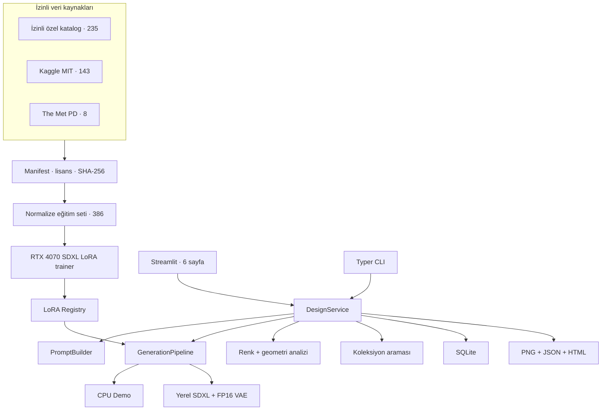
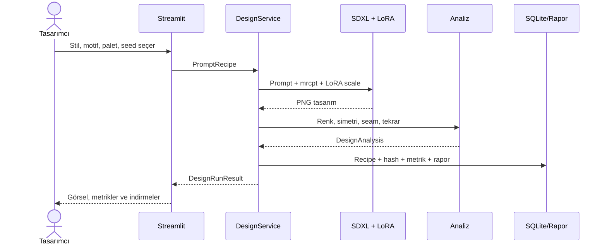
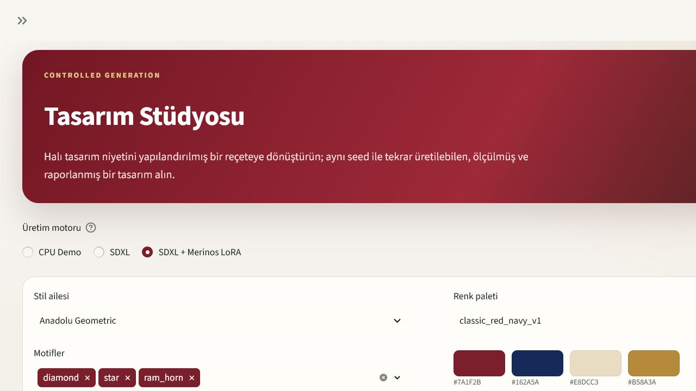
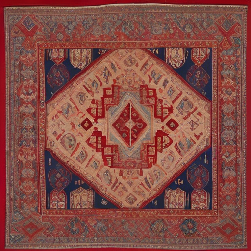
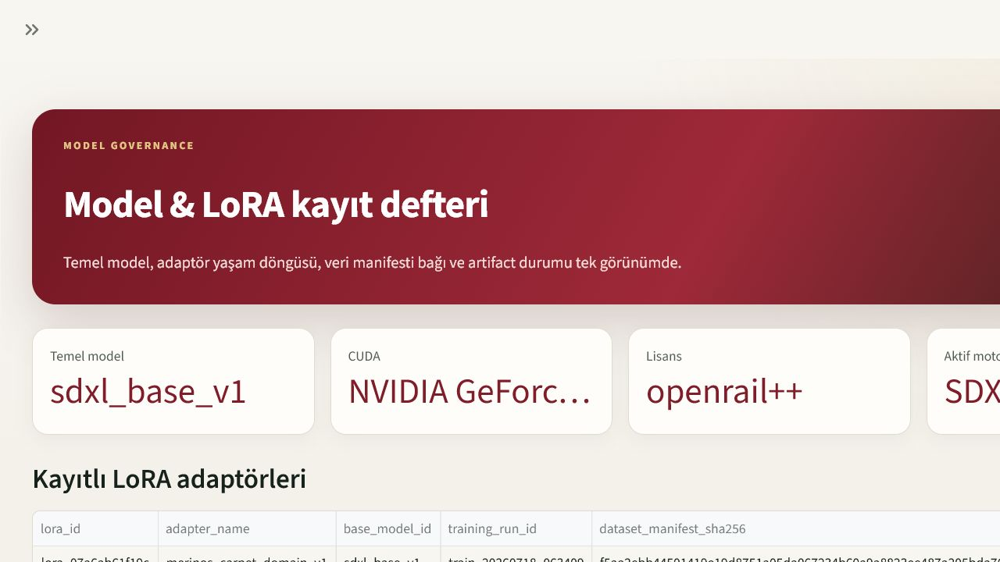
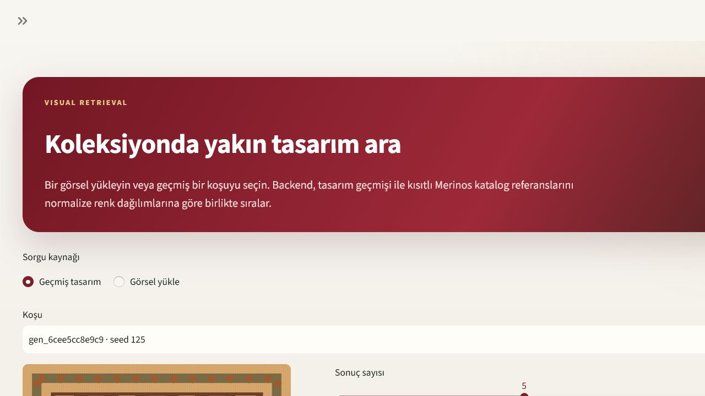
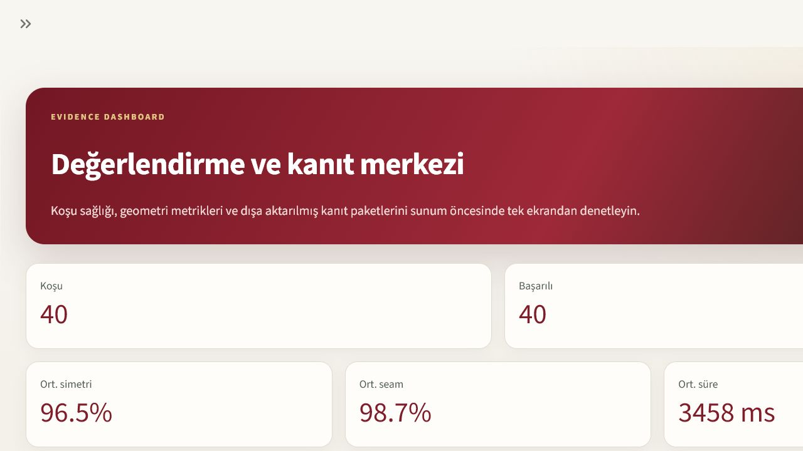
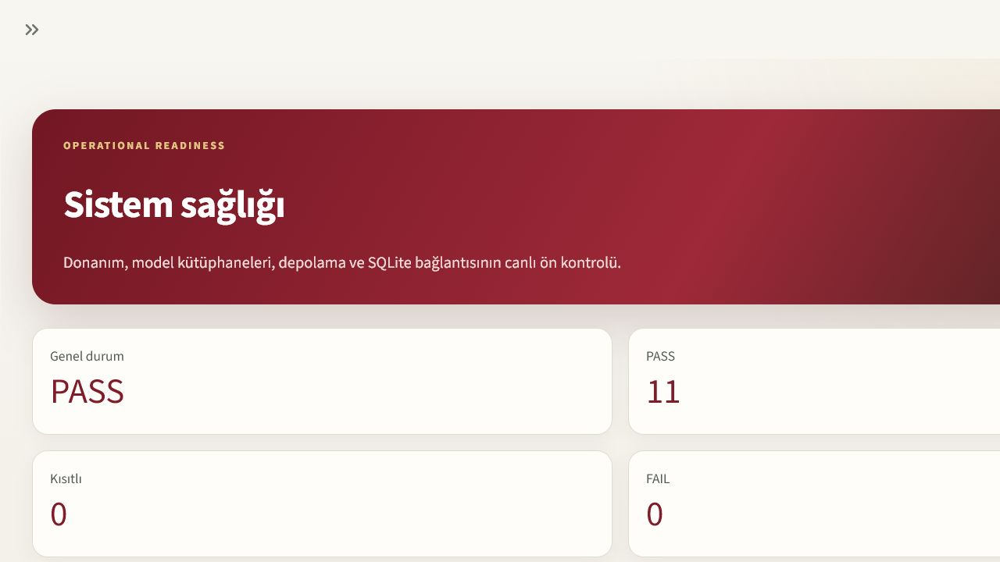

# Halı AI Carpet Design

> İzin ve kaynak kökeni izlenebilen, SDXL + LoRA tabanlı, tasarım analizi ve koleksiyon aramasıyla
> birlikte çalışan profesyonel halı tasarım stüdyosu.


**Son doğrulama:** 18 Temmuz 2026  
**Pilot durumu:** Çalışan bağımsız teknik pilot  
**Aktif LoRA:** `lora_07a6ab61f19c` · rank 4 · `ACTIVE_COMPANY_PILOT`  
**Uygulama:** [http://127.0.0.1:8501/Design_Studio](http://127.0.0.1:8501/Design_Studio)

---

## 1. Proje özeti ve vizyon

Halı AI Carpet Design; tasarımcının stil, motif, kompozisyon, bordür, simetri ve renk paleti
seçimlerini yapılandırılmış bir prompt reçetesine dönüştürür. Reçete, yerel SDXL modeli ve halı
tasarımı alanına uyarlanmış LoRA adaptörüyle görsele çevrilir. Aynı işlem içinde renk ve geometri analizi
yapılır, benzer katalog tasarımları aranır ve tüm kanıtlar SQLite, PNG, JSON ve HTML olarak saklanır.

Projenin vizyonu, tasarımcının yerini almak değil; fikir çeşitlendirme, kontrollü deneme, ölçülebilir
karşılaştırma ve mühendislik izlenebilirliği sağlayan bir **AI destekli tasarım çalışma alanı**
oluşturmaktır.

### Ürün ne sağlar?

- 🎨 Stil, motif, kompozisyon, bordür, simetri ve palet seçimi
- 📝 Kontrollü prompt mühendisliği ve negatif prompt üretimi
- 🚀 CPU demo, taban SDXL ve SDXL + Carpet LoRA üretim motorları
- 📊 CIELAB/Delta E renk analizi, simetri, seam ve tekrar ölçümleri
- 🔍 Üretilmiş tasarımlar ve izin kaydı bulunan kısıtlı katalogda benzerlik araması
- 🧬 İzinli özel katalog, Kaggle ve açık müze verisiyle izlenebilir LoRA eğitimi
- 💾 PNG, JSON ve bağımsız HTML kanıt raporu indirme
- 🗃️ Model/LoRA yaşam döngüsü ve SHA-256 kayıt defteri
- 🩺 GPU, kütüphane, disk ve veritabanı sağlık kontrolleri

### Kapsam dışı iddialar

Bu sistem tek başına imalat uygunluğu, hukuki özgünlük, telif güvenliği veya seri üretim onayı
vermez. Koleksiyon araması bir “özgünlük garantisi” değildir. Üretim çıktıları, tasarım ve üretim
ekiplerinin insan incelemesinden geçmelidir.

---

## 2. Tasarım ve üretim ekipleri için değer önerisi

| Değer alanı | Beklenen katkı |
|---|---|
| Tasarım hızı | Aynı brief için deterministik ve karşılaştırılabilir varyantlar üretme |
| Koleksiyon sürekliliği | İzinli özel katalog ve seçili açık halı mirasıyla alan uyarlaması |
| Tasarım kontrolü | Serbest metin yerine stil, motif, bordür, simetri ve palet sözleşmesi |
| Kurumsal hafıza | Prompt, seed, model, LoRA, analiz ve raporların SQLite'ta saklanması |
| Risk yönetimi | Her veri kaynağı için lisans, izin referansı, manifest ve SHA-256 kaydı |
| Teknik şeffaflık | Base-vs-LoRA karşılaştırması, model kayıt defteri ve sağlık ekranı |
| Sunum ve paylaşım | PNG görsel, JSON teknik kayıt ve tek dosyalık HTML kanıt raporu |

Pilot, tasarım ekibine “tek tuşla nihai ürün” sunmak yerine fikirden ölçülebilir dijital tasarım
adayına uzanan kontrollü bir çalışma akışı sağlar.

---

## 3. Baştan sona proje yolculuğu

```mermaid
flowchart LR
    A["Fikir ve kapsam"] --> B["Repo ve kalite temeli"]
    B --> C["Veri yönetişimi"]
    C --> D["CPU demo ve SDXL inference"]
    D --> E["RTX 4070 LoRA eğitimi"]
    E --> F["Renk ve geometri analizi"]
    F --> G["Koleksiyon araması"]
    G --> H["Değerlendirme ve kanıt"]
    H --> I["Profesyonel Streamlit ürünü"]
    I --> J["Aktif teknik pilot"]
```



### Kronolojik işlem özeti

1. Carpet Designer ürün sınırı, WeaveVision/anomali tespitinden ayrıldı.
2. Kanıtsız kalite, imalat ve özgünlük iddialarını engelleyen claim sözleşmesi tanımlandı.
3. Python 3.11, uv, typed settings, logging, CLI, SQLite ve test çatısı kuruldu.
4. Model gerektirmeyen deterministik CPU demo motoru geliştirildi.
5. Prompt taxonomy, recipe şeması ve negatif prompt sözleşmesi oluşturuldu.
6. Renk, simetri, seam ve tekrar analizi backend akışına bağlandı.
7. Altı sayfalı Streamlit ürün arayüzü ve rapor indirmeleri geliştirildi.
8. Kısıtlı özel katalogdan 15 koleksiyona ait 235 ürün ve metadata içe aktarıldı.
9. Eğitim yetkisi, kullanıcı beyanına dayalı yazılı hak sahibi izin referansıyla kaydedildi.
10. Kaggle Safavid veri setindeki 143 orijinal görsel indirildi; 429 artırılmış kopya dışlandı.
11. The Met Open Access örneklerinden 8 ilgili halı/tekstil kaydı seçildi.
12. 386 görsel 768×768 biçimine normalize edildi; 0 kopya ve 0 geçersiz dosya raporlandı.
13. RTX 4070 için PyTorch `2.8.0+cu126`, CUDA 12.6 ve bitsandbytes ortamı kuruldu.
14. Hugging Face statik dosya bağlantı sorunu, resmî ModelScope SDXL aynasıyla aşıldı.
15. Çok parçalı, devam edebilir model indirme aracı geliştirildi ve yerel SDXL paketi doğrulandı.
16. Diffusers v0.39 SDXL LoRA eğitimi 8 GiB VRAM için optimize edildi.
17. Gerçek tek adımlık rank-2 CUDA smoke eğitimi tamamlandı.
18. 386 görselle rank-4, 100 adımlık teknik pilot eğitimi tamamlandı.
19. Nihai LoRA safetensors, manifest, hash, checkpoint ve metrikleri kayıt altına alındı.
20. Aynı prompt/seed için base ve LoRA üretimleri karşılaştırılarak adaptör etkisi doğrulandı.
21. Aktif LoRA yerel SDXL backend'ine ve Streamlit Tasarım Stüdyosu'na bağlandı.
22. 52 otomatik test, Ruff, mypy, sistem doktoru ve canlı HTTP sağlık kontrolü geçti.
23. Uygulama ekranları gerçek çalışan sistemden alınarak bu portföye eklendi.

---

## 4. Fazlar ve kabul kapıları

| Faz | Amaç | Mevcut durum | Ana kanıt |
|---|---|---|---|
| M0 | Workspace audit ve kapsam kilidi | ✅ Tamamlandı | Master spec, ürün sınırı, claim sözleşmesi |
| M1 | Repository bootstrap | ✅ Tamamlandı | uv, settings, CLI, logging, tests, doctor |
| M2 | Dataset governance | ✅ Tamamlandı | Lisans kayıt tablosu, manifest, data card, 386 görsel |
| M3 | Prompt ve base inference | ✅ Tamamlandı | CPU demo + gerçek yerel SDXL üretimi |
| M4 | LoRA eğitimi | ✅ Tamamlandı | Smoke + 100 adım, safetensors, checkpoint, registry |
| M5 | Tasarım analizi | ✅ Pilot kapsamı tamam | Delta E, simetri, seam, repeatability |
| M6 | Retrieval ve koleksiyon | 🟡 Pilot kapsamı | Geçmiş üretim + izinli özel katalog araması |
| M7 | Değerlendirme | 🟡 Kısmi | Dashboard ve tek koşu base-vs-LoRA; FID/human review bekliyor |
| M8 | Streamlit ürünü | ✅ Tamamlandı | Altı sayfa, indirmeler, degraded mode, canlı test |
| M9 | CI, Docker ve release | 🟡 Yapı hazır | Workflow ve Docker dosyaları mevcut; release build ayrıca doğrulanmalı |
| M10 | Tasarım pilotu | ✅ Teknik pilot aktif | `ACTIVE_COMPANY_PILOT`; bağımsız kurul onayı bekliyor |

### M0 — Workspace Audit and Scope Lock

**Amaç:** Ürünün ne olduğunu ve ne olmadığını kesinleştirmek.

- Carpet Designer, halı tasarım üretimi ve incelemesi olarak tanımlandı.
- WeaveVision/anomali ve kusur tespiti ayrı ürün sınırında bırakıldı.
- Kanıtsız “üretilebilir”, “özgün”, “telif güvenli” ve “gerçek zamanlı” iddiaları yasaklandı.
- Durum sözlüğü oluşturuldu: `PASS`, `BLOCKED`, `DEMO_ONLY`, `LICENSE_BLOCKED` vb.

### M1 — Repository Bootstrap

**Amaç:** Tekrarlanabilir geliştirme ve kalite tabanı kurmak.

- Python 3.11 ve uv kilit dosyası
- Pydantic settings ve `.env` ayrımı
- JSON tabanlı logging
- Typer CLI
- SQLite migration/repository katmanı
- Ruff, mypy ve pytest kontrolleri
- CPU ve CUDA Docker tanımları

**Kabul sonucu:** Sistem doktorunda 11/11 kontrol `PASS`; 38 test geçti.

### M2 — Dataset Governance

**Amaç:** Her eğitim görselinin kaynağını ve kullanım yetkisini izlemek.

| Kaynak | Seçilen | Dışlanan | Yetki |
|---|---:|---:|---|
| Kısıtlı özel katalog | 235 | 0 indirme hatası | Hak sahibi eğitim izni referansı |
| Kaggle Safavid | 143 orijinal | 429 artırılmış kopya | MIT |
| The Met Open Access | 8 ilgili | 21 ilgisiz kayıt | Public domain |
| **Birleşik set** | **386** | **0 duplicate, 0 invalid** | `TRAINING_APPROVED` |

Birleşik manifest içerik hash'i:
`f5aa2ebb44501419e19d8751a05da067234b60a9a8823ee487a205bda76e18dd`.

Hak sahibi yetkisi `USER_ATTESTED_WRITTEN_PERMISSION_2026-07-18` referansıyla kaydedilmiştir. İmzalı
belgenin kendisi repoda değildir; yetkili tarafın doküman yönetim sisteminde tutulmalıdır.

### M3 — Prompt and Base Inference

**Amaç:** Modelden bağımsız bir ürün sözleşmesi ve gerçek inference hattı oluşturmak.

- Kontrollü stil, motif, kompozisyon, bordür, simetri ve palet alanları
- Deterministik seed
- Varsayılan negatif kısıtlar
- CPU prosedürel demo motoru
- Yerel SDXL Base 1.0 ve sabit FP16 VAE
- 8 GiB kart için model CPU offload, attention slicing ve VAE tiling

CPU demo ve SDXL aynı `DesignRunResult` şemasını döndürür. Bu sayede frontend, analiz, veritabanı ve
raporlama katmanları motor değişiminden etkilenmez.

### M4 — LoRA Training

**Amaç:** İzinli özel katalog ve açık halı verisini SDXL üzerinde alan adaptasyonuna dönüştürmek.

- Diffusers v0.39 SDXL DreamBooth LoRA tabanı
- FP16 mixed precision
- 8-bit Adam
- Gradient checkpointing
- Batch 1, gradient accumulation 4
- Rank 4
- 512×512 eğitim çözünürlüğü
- 100 optimizer adımı
- Checkpoint 50 ve 100
- `mrcpt` tetikleyici token'ı

Güncel eğitim katmanı, bu tarihsel pilot profilini korurken ikinci bir caption-aware profil de sunar.
`metadata.jsonl` ile her görsel kendi motif/stil/palet açıklamasını kullanabilir. Arayüzden rank,
learning rate, adım, Min-SNR A/B, sabit validasyon promptu/seed'i, checkpoint sınırı ve `latest`
devam ettirme ayarlanabilir. Yönlü motifleri korumak için random flip varsayılan olarak kapalıdır.

Nihai artifact:

```text
LoRA ID        : lora_07a6ab61f19c
Training run   : train_20260718_063409
Artifact       : pytorch_lora_weights.safetensors
Artifact size  : 23,390,424 byte
Tensor count   : 1,120
SHA-256        : 66eadc5146cfbde5307e59a96c9562416fc241f9d2a8be59d5f52a0620d151d3
Lifecycle      : ACTIVE_COMPANY_PILOT
```

### M5 — Design Analysis

Her üretimden sonra aynı backend çağrısında:

- CIELAB baskın renk çıkarımı
- Palet eşleşmesi ve ortalama Delta E
- Yatay, dikey ve 180° simetri
- Sol-sağ / üst-alt seam sürekliliği
- Otokorelasyon tabanlı tekrar sinyali
- Dijital tasarım ve imalat tavsiye sınırı

Analiz sonuçları üretim raporuna ve SQLite'a kaydedilir.

### M6 — Retrieval and Collection

Koleksiyon Arama sayfası iki sorgu kaynağını destekler:

1. Önceki bir tasarım koşusu
2. Kullanıcının yüklediği görsel

Backend, üretilmiş tasarımları ve izinli özel katalog referanslarını normalize renk dağılımıyla
sıralar. Bu sonuç benzerlik sinyalidir; hukuki özgünlük kararı değildir. Bir sonraki iyileştirme
kapısı pHash/embedding hibriti ve kalibre edilmiş eşiklerdir.

### M7 — Evaluation

Değerlendirme paneli koşu sayısını, başarı oranını, simetri/seam ortalamasını, gecikmeyi ve kanıt
raporlarını gösterir. Aynı seed/prompt ile bir base-vs-LoRA doğrulaması yapılmıştır.

Tam M7 kapanışı için hâlâ gerekenler:

- Kilitli ve bağımsız doğrulama seti
- Aynı protokolle çok örnekli base-vs-LoRA benchmark
- FID, KID ve prompt-image similarity
- Kör insan değerlendirmesi ve değerlendiriciler arası uyum
- Failure gallery

### M8 — Professional Streamlit Product

Altı sayfa tek bir profesyonel uygulamada birleşmiştir:

1. **Design Studio:** tek tasarım, prompt reçetesi, LoRA, analiz ve indirmeler
2. **Variant Lab:** yüklenen halıdan kontrollü image-to-image ve deterministik seed varyantları
3. **Collection Search:** geçmiş tasarım veya dosya ile benzerlik araması
4. **LoRA Registry:** model, artifact, izin ve yaşam döngüsü görünümü
5. **Evaluation:** operasyon ve kanıt paneli
6. **System Health:** GPU, runtime, disk ve SQLite canlı kontrolü

### M9 — CI, Docker and Release

Projede GitHub workflow tanımları, CPU/CUDA Dockerfile'ları ve Compose dosyaları bulunur. Yerel kod
kalitesi geçmiştir. Kurumsal release öncesinde temiz bir runner üzerinde Docker build, security scan
ve secret taraması yeniden çalıştırılmalıdır.

### M10 — Company Design Pilot Ready

İzinli kısıtlı katalog verisi, gerçek RTX 4070 eğitimi, aktif LoRA, yerel inference ve çalışan frontend
birleşmiştir. Bu nedenle teknik pilot aktiftir. Üretim ortamına yükseltme için tasarım kurulu, hukuk,
bilgi güvenliği ve imalat profili kapıları ayrıca geçilmelidir.

---

## 5. Teknik mimari

Sistem, Streamlit ve CLI'ın aynı backend servis katmanını kullandığı modüler bir monolittir.



### Çalışan üretim akışı



### Ana modüller

| Katman | Konum | Sorumluluk |
|---|---|---|
| UI | `src/carpet_designer/ui/` | Streamlit sayfaları ve bileşenleri |
| Service | `services/design_service.py` | Üretim, analiz, kalıcılık ve rapor orkestrasyonu |
| Model | `models/pipeline.py` | CPU demo / SDXL / LoRA yükleme ve inference |
| Prompt | `prompts/recipe.py` | Pozitif ve negatif prompt üretimi |
| Training | `training/trainer.py` | İzin kapısı ve SDXL LoRA eğitimi |
| Data | `data/` | Adapter, manifest, normalize set ve provenance |
| Analysis | `analysis/` | Renk, simetri, seam ve tekrar ölçümü |
| Retrieval | `retrieval/` | Index ve benzerlik bileşenleri |
| Evaluation | `evaluation/` | Benchmark ve değerlendirme sözleşmesi |
| Persistence | `persistence/` | SQLite migration ve repository'ler |
| Reporting | `reporting/` | JSON ve bağımsız HTML kanıt raporları |

---

## 6. Uygulama ekranları

### Tasarım Stüdyosu — aktif Carpet LoRA

Motor seçimi formdan bağımsızdır; `SDXL + Carpet LoRA` seçildiğinde en fazla üç kayıtlı adaptör
hibritlenebilir. Her adaptörün ham etkisi ayrı slider ile değiştirilir; LoRA ID, eğitim koşusu ve
normalize hibrit payı aynı tabloda görünür. Üretim reçetesi tüm adaptörleri ve gerçek etkilerini ayrı
alanlarda saklar.



### Varyant Laboratuvarı — referans görselden kontrollü alternatifler

PNG/JPEG/WEBP halı görseli doğrulanıp içerik hash'iyle yerel artifact deposuna alınır. Kullanıcı stil,
kompozisyon, palet, motif, bordür, simetri ve çözünürlük alanlarından hangilerinin değişebileceğini ayrı
kutucuklarla belirler. İşaretlenmeyen özellikler kaynak koruma sözleşmesine eklenir; kaynak paleti ve
en-boy oranı isteğe bağlı korunur. CPU demo deterministik görsel harmanlama, SDXL ise gerçek
image-to-image pipeline kullanır.

### Örnek gerçek SDXL + LoRA çıktısı



### Model ve LoRA kayıt defteri

Kayıt tablosunun altındaki katlanabilir **Eğitim Laboratuvarı**, ana sayfa düzenini değiştirmeden deney
planı oluşturur, veri manifest hash'ini JSON plana yazar ve açık onayla GPU eğitimini arka planda
başlatır. Son PID ve log kuyruğu aynı alanda izlenebilir.



### Koleksiyon benzerlik kontrolü



### Değerlendirme ve kanıt paneli



### Sistem sağlığı



---

## 7. Kurulum

### Ön koşullar

- Windows 10/11 veya uyumlu Linux
- Python 3.11
- [uv](https://docs.astral.sh/uv/)
- CPU demo için GPU gerekmez
- Gerçek SDXL/LoRA için NVIDIA CUDA GPU; pilot RTX 4070 Laptop 8 GiB ile doğrulanmıştır

### 1. Ortamı kurun

```powershell
git clone <repository-url>
cd Hali_AI_Carpet_Design
uv venv --python 3.11
uv sync --all-extras
```

### 2. Ortam ayarlarını hazırlayın

```powershell
Copy-Item .env.example .env
```

`.env` içine yalnız gerekli yerel değerleri ekleyin:

```dotenv
CARPET_DESIGNER_DEVICE=auto
CARPET_DESIGNER_GENERATION_MODE=auto
CARPET_DESIGNER_HUGGINGFACE_TOKEN=
CARPET_DESIGNER_RESTRICTED_CATALOG_PERMISSION_REF=
```

Token, model, hakları kısıtlı katalog verisi veya üretim artifact'i Git'e eklenmemelidir.

### 3. Sistem doktorunu çalıştırın

```powershell
uv run carpet-designer doctor
```

Beklenen pilot ortamı:

```text
Python       PASS
GPU          PASS · NVIDIA GeForce RTX 4070 Laptop GPU
PyTorch      PASS · 2.8.0+cu126
Diffusers    PASS · 0.39.0
Database     PASS
Overall      PASS
```

### 4. Uygulamayı başlatın

```powershell
uv run carpet-designer serve
```

Ardından [Tasarım Stüdyosu](http://127.0.0.1:8501/Design_Studio) sayfasını açın.

---

## 8. Veri setini yeniden oluşturma

Ham veri, model ağırlıkları ve normalize görseller Git dışında tutulur.

```powershell
# Kısıtlı özel katalog (yalnız açık hak sahibi izniyle)
uv run python scripts/import_restricted_catalog.py --base-url <authorized-url> --collections <name>

# Kaggle Safavid orijinalleri
uv run python scripts/import_kaggle_safavid.py

# İzin kapısı, normalizasyon ve birleşik manifest
uv run python scripts/build_training_dataset.py
```

Çıktılar:

```text
data/external/restricted_catalog/
data/external/kaggle/safavid/
data/external/met/
data/processed/carpet_lora_v1/
```

Kaynak ve izin ayrıntıları için:
[docs/DATASET_AND_LICENSE_REGISTER.md](docs/DATASET_AND_LICENSE_REGISTER.md)

---

## 9. LoRA eğitimi

### Tek adımlık CUDA smoke

```powershell
uv run carpet-designer training train `
  --dataset-manifest data/processed/carpet_lora_v1/manifest.json `
  --output-dir artifacts/models/lora_smoke_rtx4070 `
  --max-train-steps 1 `
  --resolution 512 `
  --rank 2 `
  --training-mode single_prompt
```

### Onaylı pilot koşusu

```powershell
uv run carpet-designer training train `
  --dataset-manifest data/processed/carpet_lora_v1/manifest.json `
  --output-dir artifacts/models/carpet_domain_v1 `
  --max-train-steps 100 `
  --resolution 512 `
  --rank 4 `
  --training-mode caption_aware `
  --checkpointing-steps 25 `
  --checkpoints-total-limit 3
```

Min-SNR karşılaştırma koşusu için aynı komuta `--snr-gamma 5.0`; kesilen koşuyu sürdürmek için
`--resume-from-checkpoint latest` eklenir. Caption-aware profil, veri klasöründeki
`metadata.jsonl` dosyasını ve her satırdaki `file_name` + `text` çiftini başlamadan önce doğrular.

Başarılı koşu şu dosyaları üretir:

```text
artifacts/models/carpet_domain_v1/
├── checkpoint-50/
├── checkpoint-100/
├── pytorch_lora_weights.safetensors
├── training.log
├── metrics.json
└── lora_manifest.json
```

Tam protokol: [docs/TRAINING_PROTOCOL.md](docs/TRAINING_PROTOCOL.md)

---

## 10. Kullanım örnekleri

### Tasarım Stüdyosu

1. Stil ailesini seçin.
2. Motif, kompozisyon, bordür ve simetri niyetini belirleyin.
3. Kurumsal paletlerden birini seçin.
4. Üretim motorunu seçin:
   - `CPU Demo`: hızlı, deterministik ürün demosu
   - `SDXL`: taban model
   - `SDXL + Carpet LoRA`: aktif teknik pilot
5. Bir ila üç LoRA bileşeni seçin; her birinin etkisini `0.0–1.5` arasında ayrı ayarlayın.
6. Ham etki ve normalize hibrit paylarını özet tablosunda doğrulayın.
7. Seed ve çözünürlüğü belirleyin.
8. “Tasarımı üret ve analiz et” düğmesine basın.
9. PNG, JSON veya HTML raporu indirin.

LoRA modu seçildiğinde `mrcpt` tetikleyicisi prompt'a otomatik eklenir.

### Varyant Laboratuvarı

1. `Halı görseli yükle` kaynağını seçin ve PNG/JPEG/WEBP referansı ekleyin.
2. Değişmesine izin verilen alanları kutucuklardan seçin: stil, kompozisyon, palet, motif, bordür,
   simetri ve çözünürlük.
3. İşaretlenen alanların yeni değerlerini belirleyin; işaretlenmeyenler kaynak koruma promptuna yazılır.
4. Kaynak en-boy oranı, varyant sayısı, başlangıç seed'i ve `0.05–0.95` değişim gücünü ayarlayın.
5. CPU Demo, SDXL veya kayıtlı LoRA ile SDXL motorunu seçip kontrollü varyant setini üretin.
6. Referans hash'i, kaynak paleti, uygulanan değişim sözleşmesi ve kalite metriklerini karşılaştırma
   panosunda inceleyin.

### CLI ile deterministik üretim

```powershell
uv run carpet-designer generate --recipe configs/demo_recipe.json
```

### Kod kalitesi

```powershell
uv run ruff check src tests
uv run mypy src
uv run pytest -q
```

---

## 11. Doğrulanmış performans metrikleri

### Eğitim performansı

| Metrik | Sonuç |
|---|---:|
| GPU | NVIDIA GeForce RTX 4070 Laptop GPU · 8 GiB |
| Dataset | 386 görsel |
| Çözünürlük | 512×512 |
| Optimizer adımı | 100 |
| Gradient accumulation | 4 |
| Rank | 4 |
| Toplam koşu süresi | 587,223 sn |
| Gözlenen GPU belleği | yaklaşık 7,12 GiB |
| Artifact boyutu | 23.390.424 byte |
| Artifact tensor sayısı | 1.120 |

### Gerçek SDXL + LoRA inference

| Metrik | `gen_f40b1399e142` |
|---|---:|
| Boyut / adım | 512×512 / 15 |
| Toplam süre | 23.070 ms |
| Durum | PASS |
| Simetri | 0,9049 |
| Seam sürekliliği | 0,9577 |
| Repeatability | 0,5675 |
| Palet kapsamı | 0,5804 |
| Ortalama Delta E | 10,6406 |
| Uyarı | Yok |

Bu süre etkileşimli tasarım denemesi için uygundur; sub-second veya “hard real-time” iddiası
değildir.

### Canlı dashboard özeti

Dashboard anlık olarak tüm motorları birlikte toplar; aşağıdaki değerler LoRA-only benchmark değildir.

| Metrik | Değer |
|---|---:|
| Toplam koşu | 40 |
| Başarılı koşu | 40 |
| Ortalama simetri | %96,5 |
| Ortalama seam | %98,7 |
| Ortalama süre | 3.458 ms |

### FID, KID ve insan değerlendirmesi

| Metrik | Durum | Neden |
|---|---|---|
| FID | `NOT_RUN` | Bağımsız ve kilitli doğrulama referansı henüz onaylanmadı |
| KID | `NOT_RUN` | Aynı değerlendirme artifact'i bekleniyor |
| CLIPScore | `NOT_RUN` | Kilitli prompt/seed seti bekleniyor |
| Kör insan değerlendirmesi | `PENDING` | Bağımsız tasarım rubric'i ve değerlendiriciler gerekli |

FID skoru uydurulmamış veya eğitim seti üzerinde yanıltıcı biçimde hesaplanmamıştır. FID tek başına
prompt uyumu, motif doğruluğu, seam, kültürel uygunluk, özgünlük ya da üretilebilirlik kanıtı değildir.
Benchmark komutu gerekli kilitli kanıt paketi olmadan çalıştırılırsa sonuç dosyasına `NOT_RUN`, `null`
metrikler, sıfır işlenmiş örnek ve yapılandırma SHA-256 değeri yazar; sabit demo skoru üretmez.

---

## 12. Base-vs-LoRA kanıtı

Aynı seed (`407042`), prompt, çözünürlük, guidance ve inference adımlarıyla taban SDXL ve alan
LoRA üretimleri karşılaştırıldı.

| Sinyal | Sonuç |
|---|---|
| Base SHA-256 | `c798b241de3626604cccc1a9259ca40d03f45235ad3e6ca91b53e7cfc78e8523` |
| LoRA SHA-256 | `084c7ce31703939fd664367381f86277515ab40a4008934c8c744d07765e5780` |
| Aynı çıktı mı? | Hayır |
| Ortalama mutlak piksel farkı | 74,38 / 255 |

Bu kontrol LoRA'nın pipeline'a gerçekten yüklendiğini kanıtlar; tek başına estetik üstünlük iddiası
değildir. Estetik üstünlük için çok örnekli kör A/B değerlendirmesi gerekir.

---

## 13. Güvenlik, gizlilik ve yönetişim

- `.env`, API tokenları, model ağırlıkları ve hakları kısıtlı katalog verisi Git dışında tutulur.
- Trainer, `training_use=approved` ve dolu `permission_ref` olmadan eğitimi başlatmaz.
- Her model/LoRA artifact'i SHA-256 ile kaydedilir.
- Her üretim prompt, seed, model, LoRA, süre, görsel hash ve analiz metrikleriyle izlenir.
- Model subprocess'i yerel ağırlıklarla offline çalışır.
- Streamlit raporları üretim iddiası içermeyen standart uyarıyı gösterir.

---

## 14. İndirme ve paylaşma

Her başarılı tasarım için üç çıktı hazırlanır:

- **PNG:** tasarım görseli
- **JSON:** tam recipe, model, LoRA, hash, süre ve analiz şeması
- **HTML:** görseli base64 olarak içeren bağımsız sunum/kanıt raporu

HTML dosyası ek sunucu gerektirmeden kurum içi e-posta, toplantı veya arşiv akışında paylaşılabilir.
Dış paylaşım, veri hak sahibinin izin kapsamı ve projenin bilgi güvenliği kurallarına tabidir.

---

## 15. Proje yapısı

```text
Hali_AI_Carpet_Design/
├── configs/                  # Prompt taxonomy, palet ve eğitim profilleri
├── data/                     # Harici ve normalize veri; Git dışında
├── docs/                     # Mimari, veri kartı, lisans ve eğitim protokolü
├── scripts/                  # Import, dataset build ve model indirme araçları
├── src/carpet_designer/
│   ├── analysis/
│   ├── data/
│   ├── domain/
│   ├── evaluation/
│   ├── models/
│   ├── persistence/
│   ├── prompts/
│   ├── reporting/
│   ├── retrieval/
│   ├── services/
│   ├── training/
│   └── ui/
├── tests/
├── artifacts/               # Modeller, üretimler, raporlar ve SQLite; Git dışında
├── pyproject.toml
├── uv.lock
└── README2.md
```

---

## 16. Pilot sunum akışı

Mühendis ve tasarım ekiplerine önerilen 10 dakikalık demo:

1. **Sistem Sağlığı:** RTX 4070, CUDA ve 11/11 `PASS` gösterilir.
2. **Veri Yönetişimi:** 386 görsel ve izin/lisans manifesti açıklanır.
3. **LoRA Registry:** aktif rank-4 adaptör ve SHA-256 gösterilir.
4. **Design Studio:** stil, motif, palet ve `SDXL + Carpet LoRA` seçilir.
5. **Deterministik üretim:** seed sabitlenerek tasarım üretilir.
6. **Analiz:** simetri, seam, repeatability ve palet uyumu incelenir.
7. **Collection Search:** katalog benzerlik kontrolü çalıştırılır.
8. **Rapor:** PNG, JSON ve HTML indirme gösterilir.
9. **Sınırlar:** üretim/özgünlük iddiası olmadığı açıkça belirtilir.
10. **Sonraki kapı:** kör A/B değerlendirmesi ve imalat profili kararlaştırılır.

---

## 17. Sonraki yol haritası

### P0 — Pilot kalite kapısı

- Bağımsız doğrulama seti
- Çok promptlu kilitli validasyon/seed matrisi
- Çok örnekli base-vs-LoRA benchmark
- Kör bağımsız tasarım ekibi değerlendirmesi
- Failure gallery

### Tamamlanan eğitim altyapısı

- Görsel başına caption kullanan SDXL LoRA profili
- Min-SNR 5.0 A/B seçeneği
- Checkpoint sınırı ve `latest` devam ettirme
- Streamlit Eğitim Laboratuvarı ve hash'li deney planı
- Çoklu LoRA seçimi, ayrı etki değerleri ve görünür hibrit oranları
- Gerçek koşu yokken `NOT_RUN`/`null` benchmark sözleşmesi

### P1 — Retrieval 2.0

- pHash + embedding hibriti
- Duplicate ve near-duplicate sınıfları
- Koleksiyon bazlı kalibre eşikler
- Büyük katalog için FAISS index lifecycle

### P1 — İmalat profili

- Renk/çözgü/atkı/iplik sınırları
- Minimum motif ve bordür genişliği
- Makine profil kartları
- İnsan onaylı `PROFILE_CONSTRAINT_PASS/FAIL`

### P2 — Kurumsal operasyon

- GPU iş kuyruğu ve çok kullanıcılı erişim
- Rol tabanlı yetkilendirme
- Şirket içi model/artifact deposu
- CI security scan ve imzalı release
- Gözlemlenebilirlik, kota ve SLA tanımları

---

## 18. Kanıt ve referans dosyaları

- [Teknik doğrulama ve mühendis teslimi](hali-ai-technical-review.md)
- [Dataset ve lisans kayıt defteri](docs/DATASET_AND_LICENSE_REGISTER.md)
- [Data card](docs/DATA_CARD.md)
- [RTX 4070 eğitim protokolü](docs/TRAINING_PROTOCOL.md)
- [Mimari](docs/ARCHITECTURE.md)
- [Master build specification](HALI_AI_CARPET_DESIGN_MASTER_BUILD_SPEC.md)

---

## 19. Kodlama sürecim ve mühendislik kararlarım

Bu projeyi geliştirirken yalnızca çalışan bir yapay zekâ demosu hazırlamayı değil; veri kaynağı,
model, backend, kullanıcı arayüzü ve ölçüm katmanları birlikte açıklanabilen, tekrar üretilebilir
bir mühendislik ürünü ortaya çıkarmayı hedefledim. Bu nedenle geliştirme sürecini “önce modeli
çalıştır, sonra bir ekran ekle” şeklinde değil, küçük ve doğrulanabilir dikey parçalar hâlinde
ilerlettim.

### 19.1 Problemi önce ürün gereksinimlerine dönüştürmem

İlk adımda “yapay zekâ ile halı üretme” fikrini daha somut sorulara ayırdım:

- Tasarımcı hangi özellikleri kontrol edebilmeli?
- Aynı reçete ve seed ile sonuç yeniden üretilebilmeli mi?
- Modelin kullandığı veri ve adaptör nasıl izlenecek?
- Üretilen görsel yalnızca güzel görünmekle kalmayıp nasıl analiz edilecek?
- Sistem GPU veya model bulunmadığında nasıl davranacak?
- Telif, lisans ve özgünlük konusunda hangi iddialar kanıtlanabilir?

Bu sorular stil, motif, kompozisyon, bordür, simetri, palet, çözünürlük, seed ve model seçimini
tek bir tasarım reçetesinde toplamama yol açtı. Böylece arayüzdeki her seçenek backend'de
karşılığı olan açık bir parametreye dönüştü.

### 19.2 Riski küçük parçalara bölerek ilerlemem

GPU tabanlı üretimi projenin ilk bağımlılığı yapmak yerine önce deterministik CPU demo motorunu
geliştirdim. Bu motor sayesinde prompt reçetesi, servis katmanı, analiz, kayıt, raporlama ve
Streamlit akışı büyük model indirmeden test edilebildi. Dikey akış kararlı hâle geldikten sonra
gerçek SDXL inference ve LoRA adaptörünü aynı servis sözleşmesinin arkasına bağladım.

Bu sıra, bir hata oluştuğunda problemin arayüzden mi, veri sözleşmesinden mi, model yüklemeden mi
yoksa CUDA ortamından mı kaynaklandığını ayırabilmemi sağladı. CPU Demo seçeneğini son üründe de
tutmamın nedeni, sistemi GPU bulunmayan bir bilgisayarda dahi incelenebilir kılmaktır.

### 19.3 Mimariyi tek sorumluluk ilkesine göre kurmam

Frontend'in doğrudan model çağırmasını istemedim. Bunun yerine sorumlulukları katmanlara ayırdım:

- **Domain şemaları:** Tasarım reçetesi ve üretim sonucunun ortak sözleşmesi
- **Prompt katmanı:** Yapılandırılmış seçimlerin model diline çevrilmesi
- **Model katmanı:** CPU Demo, SDXL ve LoRA inference
- **Servis katmanı:** Üretim, analiz, kayıt ve raporlamanın orkestrasyonu
- **Persistence katmanı:** Prompt, seed, model, LoRA ve metrik izlerinin SQLite'ta saklanması
- **UI katmanı:** Kullanıcı girdilerinin doğrulanması ve sonuçların açıklanabilir gösterimi

Bu ayrım sayesinde yeni bir üretim motoru veya arayüz ekranı eklerken sistemin diğer parçalarını
yeniden yazmam gerekmedi. `PromptRecipe` yapısını tek doğruluk kaynağı olarak kullanmam da CLI,
Streamlit ve testlerin aynı davranışı paylaşmasını sağladı.

### 19.4 Veri setini modelden önce yönetişim konusu olarak ele almam

Veri toplama aşamasında yalnızca görsel sayısını artırmaya odaklanmadım. Her kaynak için izin veya
açık lisans durumu, kaynak adresi, koleksiyon bilgisi, dosya hash'i ve caption kaydı oluşturdum.
Kaggle veri setindeki artırılmış kopyaları orijinal veri gibi kabul etmedim; eğitim ve değerlendirme
sonuçlarını yanıltmaması için bunları ayırdım. Normalizasyon, bozuk dosya kontrolü, kopya kontrolü
ve manifest üretimini tekrarlanabilir komutlara dönüştürdüm.

Buradaki temel mantığım şuydu: Bir modelin kalitesi kadar, hangi veriyle ve hangi yetkiyle
eğitildiğinin açıklanabilmesi de ürün kalitesinin parçasıdır.

### 19.5 RTX 4070 sınırlarına uygun eğitim stratejisi seçmem

Tam SDXL modelini baştan eğitmek yerine LoRA yaklaşımını seçtim. Çünkü LoRA daha az VRAM ve disk
kullanarak stil bilgisini ayrı bir adaptörde öğrenmeye, temel modeli değiştirmeden farklı
adaptörleri yönetmeye ve sonuçları base modelle karşılaştırmaya imkân veriyordu. 8 GiB dizüstü
GPU sınırına göre mixed precision, gradient checkpointing, düşük rank, checkpoint ve devam
ettirme ayarlarını kontrollü şekilde yapılandırdım.

Önce tek adımlık CUDA smoke testiyle bütün eğitim hattını doğruladım; ardından 386 görsellik pilot
koşuya geçtim. Görsel başına caption, sabit validasyon promptları, Min-SNR seçeneği ve deney
manifesti gibi geliştirmeleri de eğitimin yalnızca “tamamlandı” şeklinde değil, karşılaştırılabilir
bir deney olarak kaydedilmesi için ekledim.

### 19.6 Ölçümleri kanıt durumundan ayırmam

Projede hesaplanmamış FID, KID veya CLIPScore değerlerini örnek sayı olarak göstermemeyi bilinçli
bir kural hâline getirdim. Bir ölçüm gerçekten çalıştırılmadıysa `NOT_RUN` ve `null`; yalnız demo
amaçlıysa `DEMO_ONLY` olarak raporlanır. Gerçek sonuçlarda veri seti, model, adaptör, seed ve kod
bağlamının saklanmasını hedefledim.

Base-vs-LoRA karşılaştırmasında aynı prompt ve seed'i kullanmamın nedeni, değişkenleri mümkün
olduğunca sabitleyerek görülen farkın adaptör etkisiyle ilişkisini güçlendirmektir. Görsel kaliteyi
tek bir puana indirgemek yerine palet uyumu, simetri, seam, repeatability, koleksiyon benzerliği ve
insan değerlendirmesini ayrı kanıt katmanları olarak ele aldım.

### 19.7 Arayüzü backend yeteneklerinin açıklanabilir karşılığı olarak tasarlamam

Streamlit arayüzünü sonradan eklenen bir vitrin değil, mühendislik sözleşmelerinin kullanıcıya
görünen yüzü olarak geliştirdim. Stil ve palet seçimi, prompt mühendisliği, model/LoRA seçimi,
üretim, analiz, benzerlik araması ve rapor indirme aynı iş akışında birleşti. Model veya GPU hazır
değilse kullanıcıya sessizce sahte sonuç göstermek yerine sistem durumunu ve fallback davranışını
açıkça gösterdim.

Varyant Laboratuvarı'nı geliştirirken de mevcut ekran düzenini bozmak yerine referans görsel,
değişim gücü ve “değişmesine izin verilen özellikler” kutularını ekledim. Kullanıcının işaretlediği
stil, kompozisyon, palet, motif, bordür, simetri ve çözünürlük alanları değiştirilebilir; diğer
özellikler korunması gereken sözleşmeye dönüşür. Kaynak paletinin çıkarılması, en-boy oranının
korunması ve SDXL image-to-image akışı bu kararın backend karşılığıdır.

### 19.8 Karşılaştığım teknik sorunları çözme yöntemim

Geliştirme sırasında her sorunu önce yeniden üretilebilir en küçük parçaya indirdim. Model indirme,
CUDA, VRAM, LoRA yükleme veya Streamlit durum yönetimi gibi alanları birbirinden bağımsız smoke
testlerle kontrol ettim. Hugging Face statik dosya erişiminde yaşanan sorun için kaynağı belirsiz
bir model kullanmak yerine resmî ModelScope SDXL aynasına geçtim ve indirilen paketi yerelde
doğruladım. VRAM sınırında ise ayarları rastgele değiştirmek yerine küçük eğitim koşuları ve kayıtlı
deney parametreleriyle ilerledim.

Her önemli düzeltmeden sonra aynı döngüyü uyguladım:

1. Beklenen davranışı ve başarısızlık koşulunu tanımladım.
2. Backend davranışını otomatik testle doğruladım.
3. Statik kod analizi ve tip kontrolünü çalıştırdım.
4. Özelliği canlı Streamlit ekranında kontrol ettim.
5. Sağlık durumunu, sınırlamaları ve kanıt dosyalarını dokümante ettim.

### 19.9 Temel kararlarımın özeti

| Karar | Gerekçem | Sonuç |
|---|---|---|
| Local-first çalışma | Özel veri ve model kontrolünü yerelde tutmak | İnternet olmadan çalışabilen, denetlenebilir pilot |
| Önce CPU Demo | GPU bağımlılığından önce ürün akışını sınamak | Hızlı test ve güvenli fallback |
| Yapılandırılmış reçete | Serbest prompttaki belirsizliği azaltmak | Tekrarlanabilir ve karşılaştırılabilir üretim |
| LoRA kullanımı | RTX 4070 sınırında verimli ince ayar | Modüler ve taşınabilir stil adaptörü |
| Servis katmanı | UI ile model kodunu ayırmak | CLI ve Streamlit için ortak backend |
| Manifest ve hash | Veri/model kökenini kanıtlamak | İzlenebilir eğitim ve üretim kayıtları |
| `NOT_RUN` sözleşmesi | Kanıtsız başarı metriğini engellemek | Daha güvenilir teknik portföy |
| Referans kontrollü varyant | Tasarım niyetini tamamen kaybetmemek | Korunan/değişen alanları görünür alternatifler |

### 19.10 Bu projeden çıkardığım mühendislik sonucu

Bu çalışma bana üretken yapay zekâ ürününün yalnızca bir model çağrısından oluşmadığını gösterdi.
Kullanılabilir bir sistem için veri yönetişimi, tekrar üretilebilirlik, donanım sınırları, hata
yönetimi, kullanıcı kontrolü, değerlendirme ve dürüst dokümantasyon birlikte tasarlanmalıdır.
Ortaya çıkan ürün bu nedenle yalnız görsel üreten bir demo değil; hangi girdiden, hangi modelle,
hangi ayarlarla ve hangi kanıtlarla sonuç üretildiğini gösterebilen uçtan uca bir teknik pilottur.

---

## 20. Nihai teknik hüküm

Halı AI Carpet Design; izin kayıtlı çok kaynaklı veri seti, gerçek RTX 4070 SDXL LoRA eğitimi,
yerel inference, profesyonel Streamlit frontend, ortak backend servis katmanı, tasarım analizi,
koleksiyon araması, SQLite izlenebilirliği ve kanıt raporlamasıyla çalışan bir **bağımsız teknik
pilottur**.

Bir sonraki hedef yeni bir demo özelliği eklemek değil; aynı protokol altında çok örnekli base-vs-LoRA
kalite değerlendirmesi ve bağımsız tasarım/üretim ekiplerinin pilot kabulüdür.
