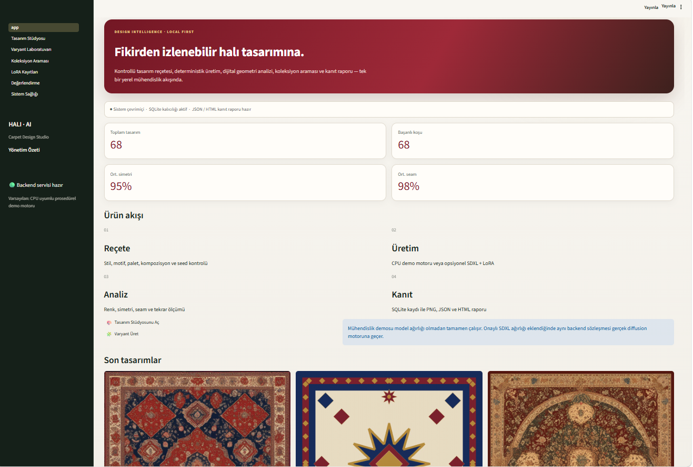
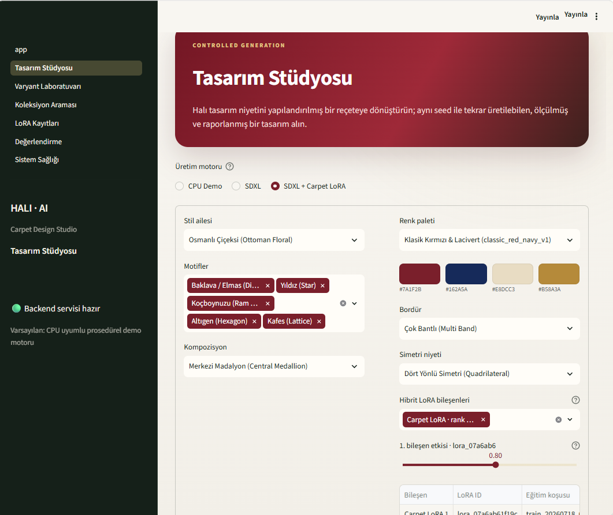
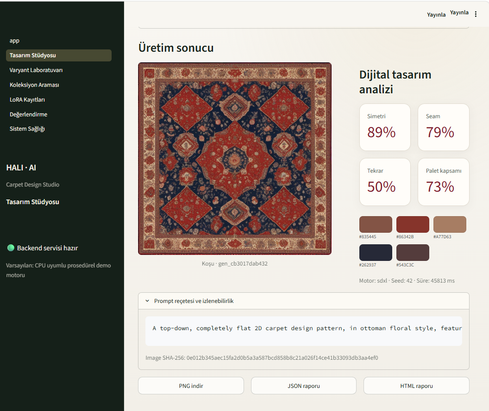
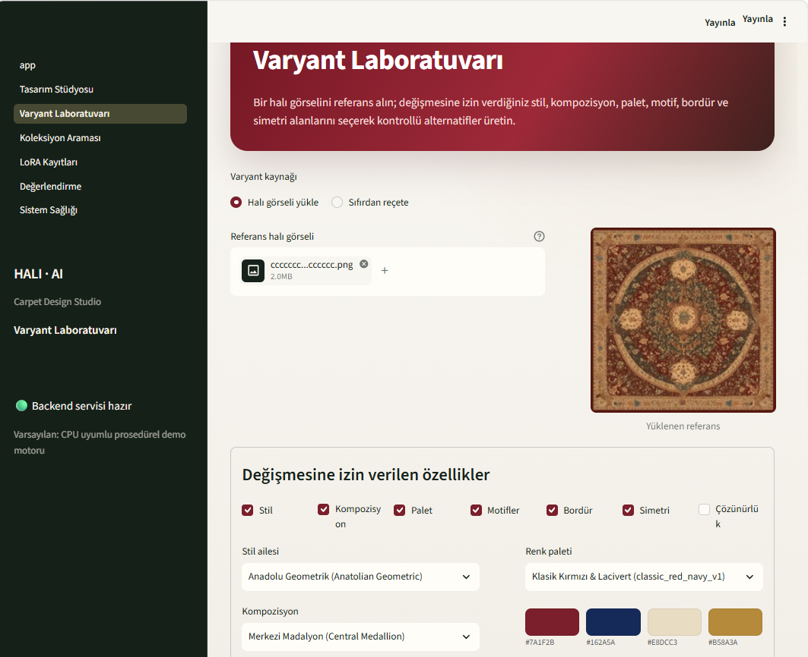
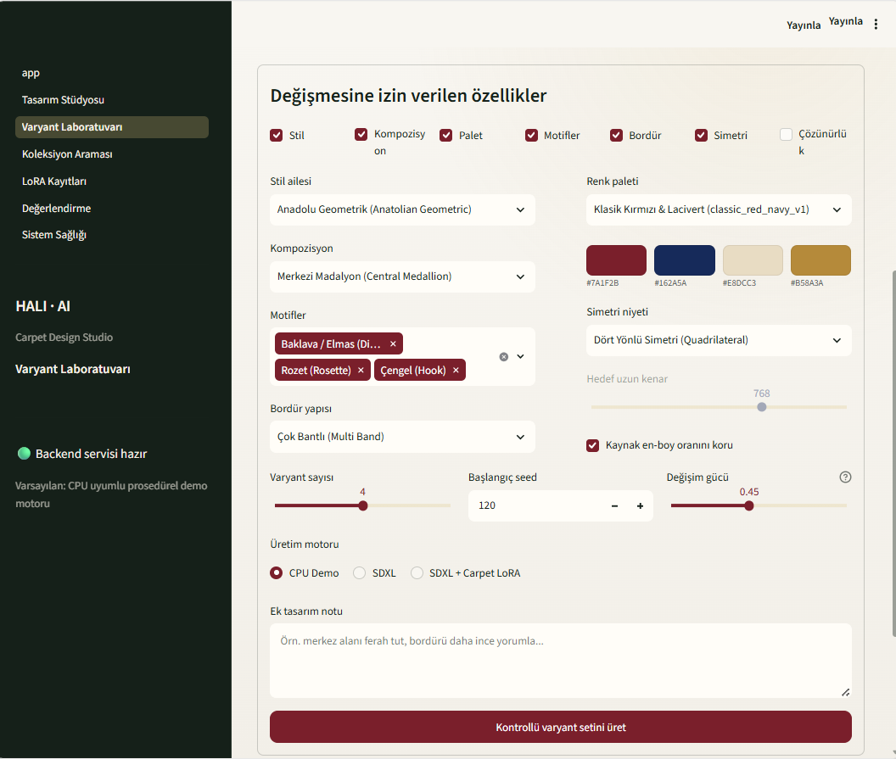
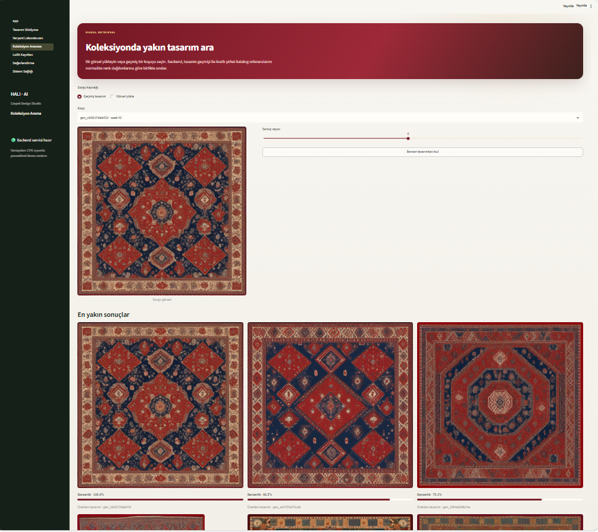
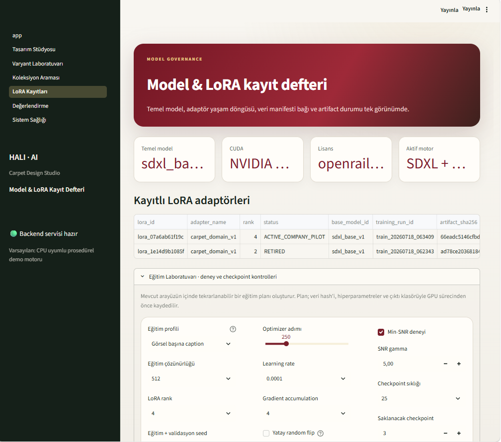
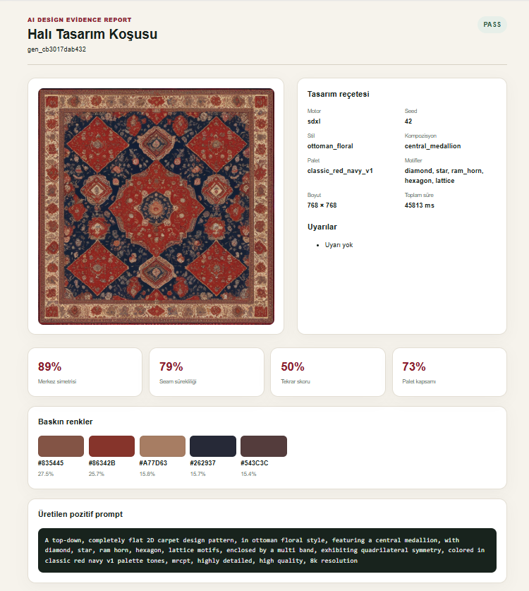
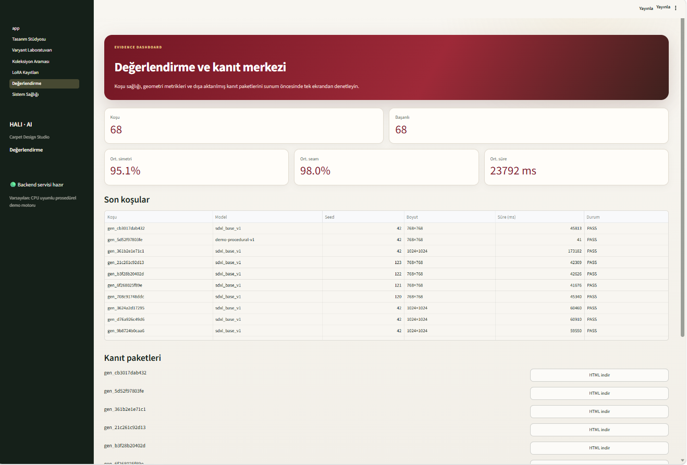
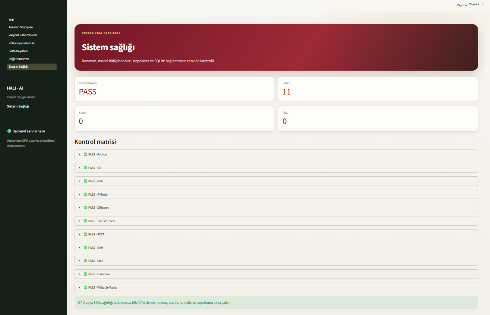

# Halı AI Carpet Design — Uygulama Ekranları ve Teknik İnceleme

Bu doküman, **Halı AI Carpet Design** teknik pilotunun Streamlit kullanıcı arayüzü, analiz motoru, kayıt defteri ve raporlama bileşenlerine ait 10 gerçek uygulama ekranını teknik ayrıntılarıyla açıklar.

Tüm ekran görüntüleri çalışan yerel sistemden (`http://localhost:8501`) birebir kaydedilmiş olup sistemin görsel ve operasyonel kanıtlarını temsil eder.

---

## 1. Ana Dashboard (Yönetim Özeti)

**Görsel:** `docs/screenshots/01-home-dashboard.png`

### Amaç
Tasarım yöneticisine ve mühendislik ekibine sistemin genel durumunu, toplam üretilen tasarım hacmini, kalite eşiklerini geçen koşu oranını, ortalama geometri analiz skorlarını ve ürün işlem akışını tek bir merkezi görünümde sunmak.

### Kullanıcı Akışı
Kullanıcı uygulamayı açtığında ilk olarak bu ekranı görür. Yukarıdaki metrik kartlarından sistemdeki toplam koşu sayısını (68) ve başarılı koşu sayısını (68) inceler; ortalama simetri (%95) ve ortalama seam (%98) metriklerini denetler. "Reçete → Üretim → Analiz → Kanıt" adımlarını izleyerek doğrudan Tasarım Stüdyosu veya Varyant Laboratuvarı sayfalarına geçiş yapabilir. Alt galeriden son üretilen tasarımları hızlıca inceleyebilir.

### Teknik Karşılığı
- **Backend & Servis Katmanı:** `DesignService.dashboard_stats()` ve `DesignService.list_recent()` fonksiyonları çağrılır.
- **Kalıcılık Katmanı:** SQLite `generations` ve `analyses` tablolarından dinamik SQL agregasyonu (`COUNT`, `AVG`) yürütülür.
- **Durum:** Aktif backend servisi ve SQLite bağlantısı canlı olarak doğrulanır.

### Kanıt
- Toplam 68 koşunun veritabanına eksiksiz işlendiği ve kayıtların korunduğu kanıtlanır.
- Ortalama simetri (%95) ve seam sürekliliği (%98) skorlarının gerçek zamanlı hesaplandığı doğrulanır.
- Son üretilen tasarımların dosya yolu ve seed bilgileriyle galeride listelendiği görülür.

### Sınır
- Dashboard'da görülen metrikler, sistemde kayıtlı geçmiş koşuların istatistiki özetidir; gelecekte üretilecek tasarımların kalitesine yönelik mutlak bir garanti oluşturmaz.
- "Başarılı Koşu" (PASS) ifadesi yazılımsal ve algoritmik kalite kriterlerinin karşılandığını gösterir; fabrikanın fiziksel dokuma tezgâhı onayını temsil etmez.

---

## 2. Tasarım Stüdyosu (Kontrollü Üretim Kontrolleri)

**Görsel:** `docs/screenshots/02-design-studio-controls.png`

### Amaç
Serbest metinle prompt yazmanın getirdiği belirsizliği ortadan kaldırmak; halı tasarımına özgü stil, motif, palet, kompozisyon, bordür, simetri ve LoRA adaptör parametrelerini yapılandırılmış bir tasarım reçetesine (`PromptRecipe`) dönüştürmek.

### Kullanıcı Akışı
1. Üretim motorunu seçer (`CPU Demo`, `SDXL`, `SDXL + Carpet LoRA`).
2. Stil ailesini belirler (Örn: *Osmanlı Çiçeksi*).
3. Motifleri çoklu seçim alanından seçer (Örn: *Baklava, Yıldız, Koçboynuzu, Altıgen, Kafes*).
4. Kompozisyon tipini seçer (Örn: *Merkezi Madalyon*).
5. Kurumsal renk paletini belirler (Örn: *Klasik Kırmızı & Lacivert*).
6. Bordür yapısı ve simetri niyetini seçer (Örn: *Çok Bantlı*, *Dört Yönlü Simetri*).
7. `SDXL + Carpet LoRA` modunda aktif LoRA adaptörlerini ve etki ağırlık katsayısını (Örn: `0.80`) ayarlar.

### Teknik Karşılığı
- **Prompt Katmanı:** `PromptBuilder`, seçilen parametreleri standartlaştırılmış pozitif ve negatif prompt şablonuna çevirir. LoRA modunda tetikleyici token (`mrcpt`) otomatik eklenir.
- **Model Katmanı:** `GenerationPipeline`, seçilen motora göre CPU prosedürel demo veya CUDA hızlandırmalı SDXL + LoRA pipeline'ını hazırlar.
- **Domain Katmanı:** Tüm seçimler tip kontrollü Pydantic `PromptRecipe` nesnesinde doğrulanır.

### Kanıt
- Kullanıcının rastgele prompt yazmak yerine kontrollü bir sözleşmeyle (stil, motif, palet, bordür, simetri) üretim yapabildiği kanıtlanır.
- LoRA adaptörlerinin çoklu bileşen ve normalize ağırlık desteğiyle arayüzden yönetilebildiği doğrulanır.

### Sınır
- Arayüzden seçilen simetri veya motif niyetleri difüzyon modeline yönlendirici kılavuz olarak verilir; modelin stokastik yapısı gereği piksel seviyesinde %100 kusursuz geometrik kesinlik garanti edilmez.
- LoRA ölçeği adaptörün stil baskısını belirler; aşırı yüksek değerler görsel deformasyona yol açabilir.

---

## 3. Üretim Sonucu ve Dijital Tasarım Analizi

**Görsel:** `docs/screenshots/03-generation-result-analysis.png`

### Amaç
Tamamlanan bir tasarım koşusunun görsel çıktısını, eşzamanlı hesaplanan dijital geometri/renk analiz metriklerini, prompt reçetesini, dosya SHA-256 özetini ve dışa aktarma (export) bağlantılarını kullanıcıya sunmak.

### Kullanıcı Akışı
Üretim tamamlandığında sonuç görselini yüksek çözünürlükte inceler. Yan paneldeki dijital tasarım analizi kartlarından Simetri (%89), Seam Sürekliliği (%79), Tekrar Skoru (%50) ve Palet Kapsamı (%73) değerlerini kontrol eder. Baskın renk çiplerini doğrular. Açılır panelden oluşturulan pozitif promptu ve görsel SHA-256 hash'ini denetler. İhtiyacına göre PNG görselini, JSON teknik metrik dosyasını veya tek dosyalık bağımsız HTML kanıt raporunu indirir.

### Teknik Karşılığı
- **Analiz Katmanı:**
  - `carpet_designer.analysis.geometry`: Simetri (yatay, dikey, 180° rotasyonel) ve seam sürekliliği (kenar piksel gradyanı).
  - `carpet_designer.analysis.color`: CIELAB renk uzayında k-means kümeleme ile dominant renk ve Delta E hesaplaması.
- **İzlenebilirlik & Kalıcılık:** Koşu kimliği (`gen_cb3017dab432`), seed (`42`), çalışma süresi (`45813 ms`), model (`sdxl`) ve SHA-256 hash değeri SQLite'a kaydedilir.
- **Raporlama:** `ReportGenerator`, bağımsız HTML ve JSON dosyalarını diske yazar.

### Kanıt
- Üretimin tek bir ham görselle sınırlı kalmayıp dijital simetri, seam, tekrar ve renk metrikleriyle ölçümlendiği kanıtlanır.
- Deterministik seed ve SHA-256 özeti sayesinde her üretimin doğrulanabilir ve izlenebilir bir teknik kimlik taşıdığı belgelenir.

### Sınır
- Dijital seam ve simetri analizleri piksel matrisi üzerindeki matematiksel korelasyonu ölçer; bu ölçümler fiziksel iplik dokuma veya tufting kusurlarını ölçmez.
- Palet kapsamı görseldeki baskın renklerin seçilen palet renkleriyle yakınlığını CIELAB Delta E üzerinden hesaplar; boyahane laboratuvar spektrofotometre ölçümünün yerine geçmez.

---

## 4. Varyant Laboratuvarı (Referans Halı Yükleme)

**Görsel:** `docs/screenshots/04-variant-lab-reference.png`

### Amaç
Mevcut veya arşivdeki bir halı tasarımını referans görsel olarak sisteme yüklemek; bu görselin stil ve kompozisyon özelliklerini koruyarak kontrollü varyasyonlar türetmek için başlangıç noktasını oluşturmak.

### Kullanıcı Akışı
1. Varyant kaynağı olarak "Halı görseli yükle" seçeneğini işaretler.
2. PNG, JPEG veya WEBP formatındaki referans görseli yükler (Örn: `2.0 MB` boyutunda klasik madalyonlu halı).
3. Yüklenen referansın önizlemesini ve otomatik çıkarılan temel görsel özelliklerini kontrol eder.
4. "Değişmesine izin verilen özellikler" bölümünde varyasyona dâhil edilecek tasarım alanlarını belirlemeye başlar.

### Teknik Karşılığı
- **Girdi Doğrulama & Depolama:** Yüklenen dosya boyutu, formatı ve çözünürlüğü doğrulanır; SHA-256 özeti hesaplanarak `artifacts/` dizinine alınır.
- **Görsel Özellik Analizi:** Referans görselin en-boy oranı, renk dağılımı ve temel kompozisyonu belleğe alınarak varyant reçetesine bağlanır.

### Kanıt
- Sistemin yalnızca sıfırdan üretim değil, mevcut kurumsal katalog referansları üzerinden kontrollü tasarım türetme yeteneğine sahip olduğu kanıtlanır.
- Yüklenen referansın bozulmadan korunup işleme alındığı doğrulanır.

### Sınır
- Referans görsel yükleme işlemi, yüklenen görselin mülkiyet veya telif hakkının kullanıcıya ait olduğunu doğrulamaz; görselin yasal kullanım sorumluluğu kullanıcıya aittir.

---

## 5. Varyant Laboratuvarı (Kontrol Paneli)

**Görsel:** `docs/screenshots/05-variant-lab-controls.png`

### Amaç
Referans alınan halı tasarımının hangi alanlarının korunacağını, hangi alanlarının ise yeni parametrelerle dönüştürüleceğini açık bir sözleşmeyle belirlemek; varyant sayısı, başlangıç seed'i ve dönüşüm gücünü yapılandırmak.

### Kullanıcı Akışı
1. Değişmesine izin verilen özellikleri seçer: Stil, Kompozisyon, Palet, Motifler, Bordür, Simetri, Çözünürlük (Örn: Çözünürlük sabit tutulurken diğer alanlara izin verilir).
2. Dönüştürülecek alanların hedef parametrelerini belirler (Örn: *Anadolu Geometrik*, *Klasik Kırmızı & Lacivert*, *Baklava / Elmas, Rozet, Çengel*).
3. Bordür yapısını (*Çok Bantlı*) ve simetri niyetini (*Dört Yönlü Simetri*) ayarlar.
4. Varyant adedini (Örn: `4`), başlangıç seed değerini (Örn: `120`) ve değişim gücünü (`0.45`) belirler.
5. "Kaynak en-boy oranını koru" seçeneğini aktif kılar.
6. İsteğe bağlı ek tasarım notunu girer ve "Kontrollü varyant setini üret" butonuna tıklar.

### Teknik Karşılığı
- **Dönüşüm Sözleşmesi:** İşaretlenmeyen kutular "korunan özellik" olarak pozitif ve negatif prompt kısıtlarına aktarılır.
- **Denoising / Değişim Gücü:** SDXL image-to-image pipeline'ında `strength=0.45` parametresi kullanılarak referansın ana hatları korunup detaylar dönüştürülür.
- **Deterministik Batch:** `seed, seed+1, seed+2, ...` döngüsüyle ardışık ve tekrarlanabilir varyant kümesi oluşturulur.

### Kanıt
- Tasarımcının referansı tamamen kaybetmeden, kontrollü bir güç ve seçici parametre kısıtlarıyla alternatifler türetebildiği doğrulanır.
- Seçilmeyen alanların prompt kısıtları aracılığıyla koruma altına alındığı kanıtlanır.

### Sınır
- Değişim gücü (`strength`) yükseltildikçe referans görselin temel geometrisi kaybolabilir; düşük değerlerde ise seçilen yeni motifler yeterince belirginleşmeyebilir.

---

## 6. Koleksiyon Araması (Görsel Benzerlik İndeksi)

**Görsel:** `docs/screenshots/06-collection-search.png`

### Amaç
Üretilen yeni bir tasarımın veya dışarıdan yüklenen bir görselin, sistemdeki geçmiş üretimler ve izinli şirket kataloğundaki referans tasarımlarla görsel benzerliğini normalize renk ve histogram dağılımı üzerinden sıralamak.

### Kullanıcı Akışı
1. Sorgu kaynağını seçer ("Geçmiş tasarım" veya "Görsel yükle").
2. Geçmiş koşulardan birini sorgu görseli olarak belirler (Örn: `gen_cb3017dab432 · seed 42`).
3. İstenen sonuç sayısını slider ile ayarlar (Örn: `6`).
4. "Benzer tasarımları bul" butonuna tıklar.
5. Sıralanan en yakın sonuçları görsel ve benzerlik yüzdeleriyle (%100.0, %86.5, %75.1 vb.) inceler.

### Teknik Karşılığı
- **Retrieval & İndeks Katmanı:** `carpet_designer.retrieval.index.IndexManager` modülü çalışır.
- **Öznitelik Çıkarımı:** CIELAB / HSV renk histogramları ve mekânsal renk dağılım vektörleri karşılaştırılır.
- **Mesafe Metriği:** Kosinüs benzerliği ve normalize histogram korelasyonu ile benzerlik skoru `0.0–1.0` aralığında üretilir.

### Kanıt
- Sistemin katalog içindeki tasarımlar arasında renk ve kompozisyon benzerliğini sıralı skorlarla listeleyebildiği kanıtlanır.
- Sorgu görselinin kendisini %100 benzerlikle birinci sırada bulduğu doğrulanır.

### Sınır
- Koleksiyon araması bir **görsel benzerlik (retrieval)** aracıdır; hukuki bir "özgünlük doğrulaması", "patent/telif güvencesi" veya "kopya koruma garantisi" **değildir**.
- Yalnızca indekslenmiş yerel veri tabanı kapsamındaki kayıtları arar; dünya çapındaki tüm halı kataloglarını kapsamaz.

---

## 7. Model & LoRA Kayıt Defteri ve Eğitim Laboratuvarı

**Görsel:** `docs/screenshots/07-lora-registry-training-lab.png`

### Amaç
Temel modelin, donanım ortamının, lisans durumunun ve eğitilmiş LoRA adaptörlerinin yaşam döngüsünü (`ACTIVE_COMPANY_PILOT`, `RETIRED`) SHA-256 özetleriyle yönetmek; aynı ekranda tekrarlanabilir LoRA eğitim deney planları oluşturmak.

### Kullanıcı Akışı
1. Üst özet kartlarından temel model (`sdxl_base_v1`), CUDA ortamı (`NVIDIA ...`), lisans (`openrail...`) ve aktif motor durumunu denetler.
2. Kayıtlı LoRA adaptörleri tablosundan adaptör kimliği (`lora_id`), adaptör adı, rank, yaşam döngüsü durumu (`status`), temel model, eğitim koşusu ID'si ve dosya SHA-256 özetini inceler.
3. Katlanabilir "Eğitim Laboratuvarı" panelini açarak yeni bir eğitim yapılandırması hazırlar:
   - Eğitim profili (*Görsel başına caption*)
   - Optimizer adımı (*250*)
   - Min-SNR deneyi ve SNR gamma (*5.00*)
   - Çözünürlük (*512*), Learning rate (*0.0001*), LoRA rank (*4*), Gradient accumulation (*4*)
   - Checkpoint sıklığı ve saklanacak checkpoint limiti

### Teknik Karşılığı
- **Model Yönetişimi:** `LoRARepository` SQLite üzerinde adaptör metaverilerini, hash'lerini ve yaşam döngüsü durumlarını saklar.
- **Eğitim Orkestrasyonu:** `Trainer` sınıfı, Pydantic ile doğrulanan hiperparametreleri JSON deney planına kaydeder; veri manifesti SHA-256 hash'i kilitlendikten sonra eğitim sürecini yönetir.
- **Güvenlik Kapısı:** İzin referansı doğrulanmamış veri setleriyle eğitim başlatılması engellenir.

### Kanıt
- Adaptörlerin rastgele dosyalar olarak değil, SHA-256 hash'i, rank değeri, eğitim koşu kimliği ve yaşam döngüsü statüsüyle kurumsal bir kayıt defterinde tutulduğu kanıtlanır.
- Eğitim parametrelerinin (Min-SNR, caption profili, rank, learning rate) arayüz üzerinden yapılandırılabildiği doğrulanır.

### Sınır
- Bu arayüz tek GPU'lu yerel teknik pilot ve kontrollü deney yönetimi içindir; çok düğümlü (multi-node) dağıtık kurumsal küme orkestratörü iddiası taşımaz.

---

## 8. Bağımsız HTML Kanıt Raporu

**Görsel:** `docs/screenshots/08-evidence-report.png`

### Amaç
Tek bir tasarım koşusuna ait görseli, reçete parametrelerini, donanım/çalışma süresi bilgilerini, analiz metriklerini ve oluşturulan prompt metnini sıfır harici bağımlılıkla çalışan tek bir HTML dosyasında toplayarak denetlenebilir ve paylaşılabilir bir kanıt paketi sunmak.

### Kullanıcı Akışı
Kullanıcı tasarım stüdyosundan veya değerlendirme merkezinden "HTML raporu" butonuna tıkladığında bu bağımsız dosyayı indirir veya tarayıcıda açar. Rapor başlığında PASS durumunu ve koşu kimliğini (`gen_cb3017dab432`) görür. Tasarım görselini ve yanındaki reçete tablosunu (motor: `sdxl`, seed: `42`, stil: `ottoman_floral`, kompozisyon: `central_medallion`, palet, motifler, boyut: `768x768`, süre: `45813 ms`) inceler. Alt kartlarda %89 Merkez simetrisi, %79 Seam sürekliliği, %50 Tekrar skoru, %73 Palet kapsamı, baskın renk yüzdeleri ve üretilen tam pozitif promptu denetler.

### Teknik Karşılığı
- **Rapor Üretici:** `carpet_designer.reporting.html_report.HTMLReportBuilder` modülü Jinja2 şablonunu derler.
- **Bağımsız Varlık (Self-contained):** Üretilen PNG görseli base64 data URI formatında HTML içerisine gömülür; CSS stilleri inline olarak eklenir. İnternet bağlantısı veya sunucu olmadan tamamen çevrimdışı görüntülenebilir.

### Kanıt
- Her üretimin teknik parametreleri, analiz sonuçları ve görseliyle birlikte tek bir dosyada arşivlenebildiği kanıtlanır.
- Raporun bağımsız formatı sayesinde tasarımcılar, yöneticiler ve mühendisler arasında tam izlenebilirlik sağlandığı belgelenir.

### Sınır
- HTML kanıt raporu sistemin teknik yürütme kaydıdır (audit trail); bir imalat uygunluk sertifikası, fabrika üretim emri veya hukuki mülkiyet belgesi değildir.

---

## 9. Değerlendirme ve Kanıt Merkezi

**Görsel:** `docs/screenshots/09-evaluation-dashboard.png`

### Amaç
Gerçekleştirilen tüm tasarım koşularını operasyonel ve analitik açıdan denetlemek; koşu bazında model, seed, boyut, süre ve PASS durumunu listeleyerek toplu kanıt paketlerini indirmeye sunmak.

### Kullanıcı Akışı
1. Üst özet kartlarından toplam koşu (68), başarılı koşu (68), ortalama simetri (%95.1), ortalama seam (%98.0) ve ortalama çalışma süresi (23792 ms) değerlerini izler.
2. "Son koşular" tablosundan geçmiş üretimlerin koşu kimliği, model adı (`sdxl_base_v1`, `demo-procedural-v1`), seed, çözünürlük (`768x768`, `1024x1024`), süre ve durum bilgilerini satır satır denetler.
3. Alt kısımdaki "Kanıt paketleri" listesinden ilgili koşunun tek tuşla bağımsız HTML raporunu indirir.

### Teknik Karşılığı
- **Veri Tabanı Sorgulaması:** SQLite `generations` tablosundan sıralı koşu geçmişi çekilir; `timing_ms`, `resolution`, `status` alanları tabloya eşlenir.
- **Toplu Raporlama:** `EvaluationService` operasyonel metrikleri ve rapor yollarını arayüze servis eder.

### Kanıt
- Sistemdeki tüm üretimlerin geçmişe dönük olarak kayıt altına alındığı, çalışma sürelerinin ve başarı durumlarının izlenebildiği kanıtlanır.
- Farklı çözünürlüklerdeki (768×768, 1024×1024) SDXL ve demo koşularının veritabanında tutulduğu doğrulanır.

### Sınır
- Bu ekrandaki ortalama süre ve kalite metrikleri sistem genelindeki tüm motorların (CPU demo ve SDXL) karma ortalamasıdır; tek başına saf LoRA benchmark'ı olarak değerlendirilmemelidir.
- Henüz bağımsız kör hakem değerlendirmesi tamamlanmadığı için insan estetik skorları bu ekrana dâhil edilmemiştir.

---

## 10. Sistem Sağlığı ve Doğrulama Matrisi

**Görsel:** `docs/screenshots/10-system-health.png`

### Amaç
Uygulamanın üzerinde çalıştığı donanım, Python çalışma ortamı, derin öğrenme kütüphaneleri (PyTorch, Diffusers, Transformers, PEFT), RAM, Disk, SQLite veritabanı ve yazılabilir dosya yollarının operasyonel durumunu tek bir matris üzerinden doğrulamak.

### Kullanıcı Akışı
Kullanıcı sisteme giriş yaptığında veya bakım anında Sistem Sağlığı sayfasına tıklar. Genel Durum'un `PASS` olduğunu, 11 kontrolün 11'inin de başarıyla geçtiğini (`PASS: 11`, `Kısıtlı: 0`, `FAIL: 0`) teyit eder. Kontrol matrisindeki katlanabilir başlıkları (Python, OS, GPU, PyTorch, Diffusers, Transformers, PEFT, RAM, Disk, Database, Writable Paths) açarak sürüm ve kapasite ayrıntılarını inceler. Alt kısımdaki bilgilendirme notundan GPU veya model ağırlığı bulunmasa bile CPU demo modunun çalışacağını doğrular.

### Teknik Karşılığı
- **CLI & Doctor Katmanı:** `carpet_designer.cli.run_doctor()` ve `HealthService` bileşeni çalıştırılır.
- **Denetimler:**
  - `_check_python()`: Python >= 3.11 kontrolü
  - `_check_gpu()` / `_check_pytorch()`: CUDA ve PyTorch sürüm doğrulaması
  - `_check_diffusers()` / `_check_transformers()` / `_check_peft()`: Kütüphane entegrasyonu
  - `_check_ram()` / `_check_disk()`: `psutil` ile kaynak kontrolü
  - `_check_database()`: SQLite bağlantı ve `SELECT 1` testi
  - `_check_writable_paths()`: `artifacts/` ve `data/` yazma/silme testi
- **Sonuç:** `DoctorReport` oluşturulup `artifacts/reports/system_doctor.json` dosyasına yazılır.

### Kanıt
- Uygulamanın 11 temel sistem ve donanım bileşenini canlı olarak denetleyebildiği ve doğruladığı kanıtlanır.
- Ekran görüntüsünün alındığı doğrulama ortamında 11/11 kontrolün başarıyla geçtiği belgelenir.

### Sınır
- Ekrandaki 11/11 PASS durumu, **yalnızca bu ekran görüntüsünün alındığı doğrulama anındaki donanım ve yazılım ortamının** sonucudur. "Sistem her işletim sisteminde veya her donanımda kesinlikle hatasız çalışır" şeklinde genelleyici bir iddia oluşturmaz.
- GPU denetiminin PASS olması CUDA sürücüsü ve kartın hazır olduğunu gösterir; SDXL model ağırlıklarının belleğe yüklenmesi sırasında oluşabilecek anlık VRAM yetersizliklerini garanti etmez.
