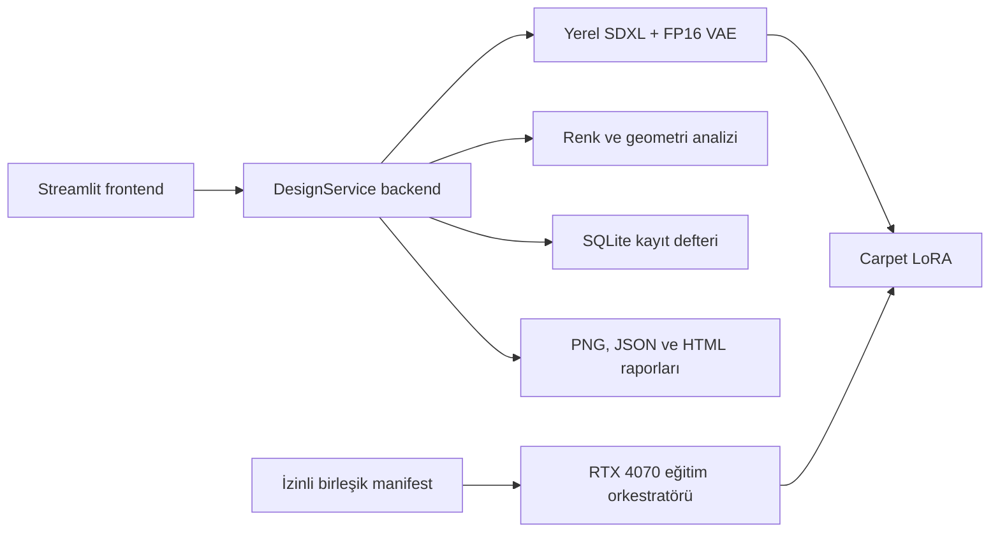

# Halı AI Carpet Design — Teknik Doğrulama ve Mühendis Teslimi

**Doğrulama tarihi:** 18 Temmuz 2026  
**Kapsam:** Veri tedariki, yönetişim, RTX 4070 SDXL LoRA eğitimi, backend, frontend ve uçtan uca üretim  
**Durum:** **ÇALIŞAN ŞİRKET PİLOTU — ÜRETİM ONAYI DEĞİLDİR**

## 1. Sonuç özeti

Sistem artık prosedürel demoyla sınırlı değildir. NVIDIA GeForce RTX 4070 Laptop GPU üzerinde gerçek
SDXL LoRA eğitimi tamamlanmış, nihai adaptör kayıt defterine alınmış ve aynı backend üzerinden gerçek
bir halı görseli üretilmiştir.

| Kontrol | Doğrulanmış sonuç |
|---|---|
| CUDA | PyTorch `2.8.0+cu126`, CUDA kullanılabilir |
| GPU | RTX 4070 Laptop, 8 GiB |
| Eğitim seti | 386 görsel |
| Kaynak dağılımı | 235 izinli özel katalog + 143 Kaggle MIT + 8 The Met public domain |
| Eğitim | SDXL LoRA, 512 px, rank 4, 100 adım, batch 1, accumulation 4 |
| Toplam koşu süresi | 587,223 saniye |
| Tepe gözlenen GPU belleği | yaklaşık 7,12 GiB |
| Nihai adaptör | 23.390.424 byte, 1.120 tensor |
| Adaptör SHA-256 public prefix | `66eadc5146cf…` |
| LoRA kayıt kimliği | `lora_07a6ab61f19c` |
| Yaşam döngüsü | `ACTIVE_COMPANY_PILOT` |
| Otomatik testler | 38 geçti |
| Ruff / mypy | geçti / geçti |

## 2. Veri ve kullanım yetkisi

Birleşik manifest `data/processed/carpet_lora_v1/manifest.json` altındadır. İçerik özeti:

- İzinli özel katalog: 15 koleksiyondan 235 ürün görseli.
- Kaggle Safavid: MIT lisanslı 143 orijinal görsel; 429 artırılmış kopya dışlandı.
- The Met: halı/tekstil ile ilgili 8 public-domain kayıt; ilgisiz 21 örnek dışlandı.
- Normalize çıktı: tam halı görünümünü koruyan 768×768 JPEG.
- SHA tabanlı tekilleştirme: 0 kopya, 0 geçersiz dosya.
- Eğitim manifest hash'i: `[REDACTED_PUBLIC]` (full value is retained in the private manifest).

Hak sahibi eğitim yetkisi uygulamada
`USER_ATTESTED_WRITTEN_PERMISSION_2026-07-18` referansıyla kaydedilmiştir. Bu, kullanıcının yazılı
izin verildiğine dair beyanını temsil eder; imzalı izin belgesinin kendisi repoda tutulmaz ve hak sahibi
doküman yönetim sisteminde saklanmalıdır.

## 3. Çalışan mimari



Frontend ve CLI aynı `DesignService` backend katmanını kullanır. Model dosyaları yerel
`artifacts/models/base/` dizininden çevrimdışı yüklenir. 8 GiB kartta model CPU offload, attention
slicing ve VAE tiling kullanılır. LoRA seçildiğinde `mrcpt` tetikleyicisi frontend tarafından prompt'a
otomatik eklenir.

## 4. Eğitim kanıtı

Nihai koşu:

- Çıktı: `artifacts/models/carpet_domain_v1/`
- Eğitim logu: `training.log`
- Ölçümler: `metrics.json`
- Yönetişim manifesti: `lora_manifest.json`
- Checkpoint'ler: adım 50 ve 100
- Nihai kayıp satırı: `loss=0.0422`, öğrenme oranı `0.0001`
- Nihai safetensors: `pytorch_lora_weights.safetensors`

Önce rank-2, tek adımlık gerçek CUDA smoke koşusu yapılmış ve başarıyla sonuçlanmıştır. Nihai rank-4
adaptör doğrulandıktan sonra smoke adaptörü `RETIRED` durumuna alınmıştır.

## 5. Uçtan uca üretim kanıtı

`lora_07a6ab61f19c` ile yapılan gerçek SDXL üretimi:

| Alan | Sonuç |
|---|---|
| Generation ID | `gen_f40b1399e142` |
| Çözünürlük / adım | 512×512 / 15 |
| Toplam süre | 23.070 ms |
| Durum | `PASS` |
| Görsel SHA-256 public prefix | `084c7ce31703…` |
| Simetri | 0,9049 |
| Dikiş sürekliliği | 0,9577 |
| Tekrarlanabilirlik | 0,5675 |

Aynı seed ve prompt ile LoRA'sız taban model ayrıca üretildi. Çıktı SHA'ları farklıdır ve ortalama
mutlak piksel farkı `74,38/255` ölçülmüştür; adaptörün üretime gerçekten uygulandığı doğrulanmıştır.

## 6. Çalıştırma

```powershell
uv sync --all-extras
uv run carpet-designer doctor
uv run carpet-designer serve
```

Tarayıcı: `http://127.0.0.1:8501/Design_Studio`

Tasarım Stüdyosu'nda **SDXL + Carpet LoRA** seçilir. Aktif adaptör varsayılan olarak ilk sıradadır;
LoRA etkisi arayüzden ayarlanabilir. CPU Demo, modelden bağımsız hızlı sunum modu olarak korunmuştur.

## 7. Pilot sınırları ve sonraki mühendislik kapıları

Bu sonuç çalışan teknik pilottur; üretim kalitesi veya imalat uygunluğu iddiası değildir.

1. Ayrı ve dondurulmuş bir onaylı doğrulama seti oluşturulmalıdır.
2. Tasarım ekibi kör A/B değerlendirmesiyle taban SDXL ve LoRA çıktılarını puanlamalıdır.
3. Koleksiyon, renk, konstrüksiyon ve iplik özellikleri dengeli etiketlerle genişletilmelidir.
4. Aşırı öğrenme ve katalog kopyalama riski için yakın-kopya taraması uygulanmalıdır.
5. İmalat kısıtları, ayrı bir teknik profil ve insan onayı olmadan `PASS` sayılmamalıdır.
6. Pilot adaptör ancak kalite, hukuk ve bilgi güvenliği kapıları birlikte geçildikten sonra üretime
   yükseltilmelidir.

## 8. Teknik kabul kararı

**Kabul:** Veri yönetişimi kapısı, gerçek CUDA eğitimi, adaptör bütünlüğü, yerel backend yüklemesi,
frontend seçimi, kalıcılık ve gerçek görsel üretimi teknik pilot için geçmiştir.

**Kabul dışı:** Seri üretim uygunluğu, hukuki özgünlük garantisi, kurumsal SLA, çok kullanıcılı GPU
kuyruklama ve tasarım kurulu kalite onayı bu koşuyla kanıtlanmış değildir.
